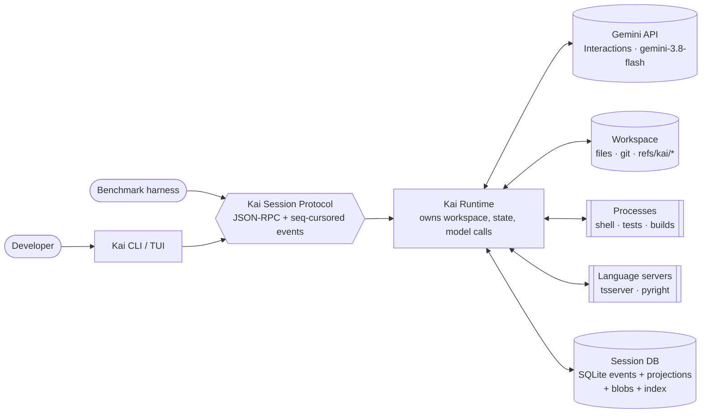
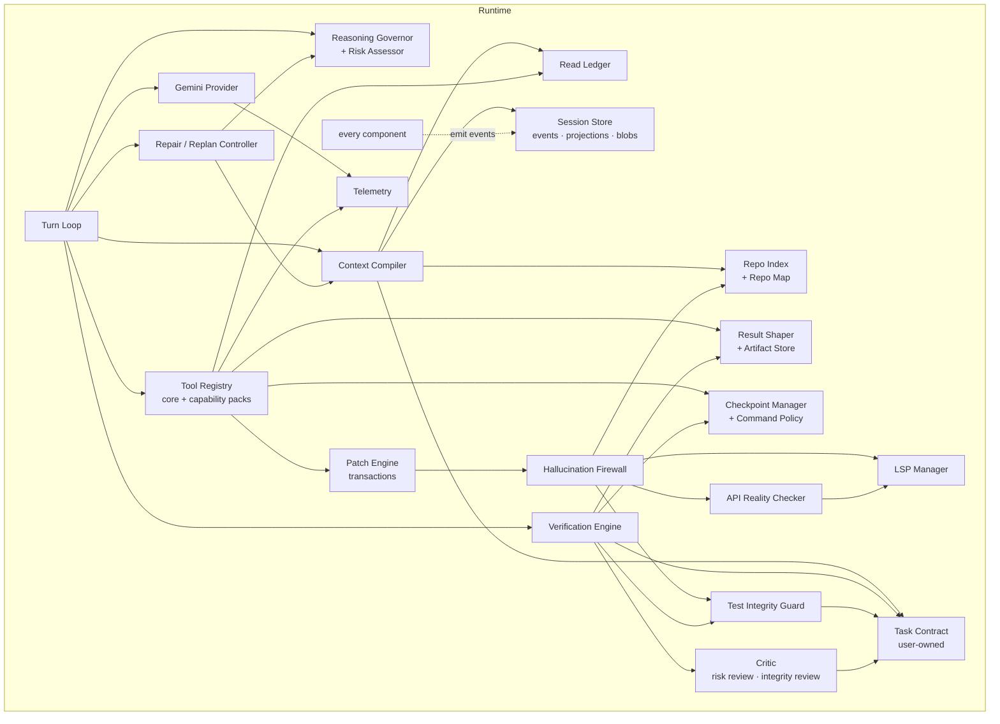
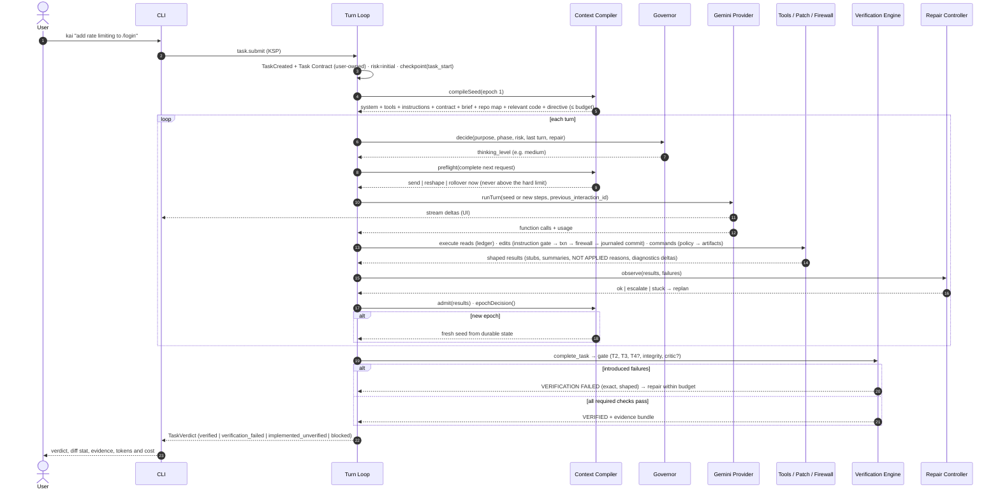
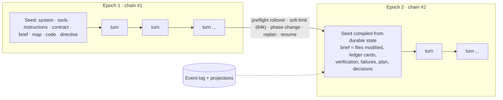
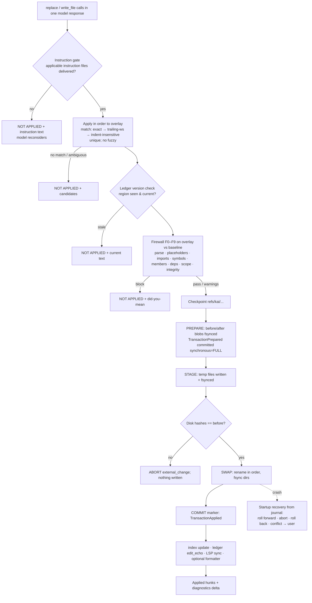

# Kai Agent: Architecture

> **Status:** proposed architecture (2026-10-05). Production implementation has not started.
> Decisions are recorded in [`docs/adr/`](docs/adr/), subsystem designs in
> [`docs/specs/`](docs/specs/), and the evidence in [`docs/research/`](docs/research/).

## 1. Goals and principles

Kai Agent is a **Gemini-first coding-agent harness** with two measurable goals:

1. **Materially lower unnecessary Gemini token consumption.**
2. **Materially reduce incorrect or hallucinated coding output.**

**Core philosophy:** *Give Gemini the smallest high-quality context necessary to solve the task,
and never trust the model's own claim that its implementation is correct.*

Design principles that follow from the research ([synthesis](docs/research/synthesis.md)):

| # | Principle | Consequence |
|---|---|---|
| P1 | **The durable event log is the source of truth. Model context is a projection.** | Context can be cut aggressively without losing anything ([ADR-0004](docs/adr/0004-durable-event-session-model.md)) |
| P2 | **Control what enters the context. Don't rewrite it.** | Ingress gating within cache-friendly append-only epochs, with deliberate epoch resets ([ADR-0005](docs/adr/0005-context-compiler-and-epochs.md)) |
| P3 | **Reject before write.** | Hallucination-class defects never reach the worktree ([firewall](docs/specs/hallucination-firewall.md)) |
| P4 | **Completion is a verified state, not a sentence.** | Only the Verification Engine can mark a task `verified` ([ADR-0009](docs/adr/0009-verification-architecture.md)) |
| P5 | **Deterministic first, model second.** | Briefs, loop detection, risk and integrity checks are deterministic. LLM calls (digest, critic) are rare and budgeted |
| P6 | **Speak Gemini natively.** | Interactions API, `thinking_level` per request, Gemini-3-shaped tools ([ADR-0003](docs/adr/0003-gemini-provider-strategy.md), [ADR-0012](docs/adr/0012-tool-surface-and-dynamic-exposure.md)) |
| P7 | **Every mechanism is measured and can be switched off.** | Ablation flags plus telemetry; mechanisms must win in the benchmark ([ADR-0014](docs/adr/0014-measurement-gated-mechanisms.md)) |
| P8 | **The runtime owns the workspace. Clients only talk the protocol.** | Typed KSP boundary from day one, in-process in v1 ([ADR-0002](docs/adr/0002-runtime-client-boundary.md)) |
| P9 | **The user owns the requirements.** | A verbatim, append-only Task Contract that only user actions can amend. Model plans are commentary, and weakening evidence needs a contract citation or user approval ([ADR-0015](docs/adr/0015-user-owned-task-contract.md)) |
| P10 | **Gates fail closed. Optional reviews may be skipped, mandatory ones may not.** | Established-only flakiness, journaled transactions with crash recovery, preflighted requests, pre-mutation instruction gate, reserved budget for mandatory integrity review ([ADR-0016](docs/adr/0016-robustness-amendments.md)) |

## 2. System context



In v1, the CLI hosts the runtime **in-process** over an in-memory KSP transport. Headless and
benchmark runs use the **stdio** transport. A daemon with WebSocket transport and other clients
come later, with no runtime changes.

## 3. Components



| Component | Responsibility (one line) | Spec |
|---|---|---|
| **Turn Loop** | Orchestrates model turns: decide effort, build the request, preflight it, stream, execute tools, admit results, observe for repair, apply epoch decisions | §5 below |
| **Task Contract** | The user's requirements, verbatim and append-only (only user actions amend it); the only authority for objective, acceptance and test-change authorization | [task-contract](docs/specs/task-contract.md) |
| **Gemini Provider** | Native Interactions API: chained or stateless state, streaming, usage, capability probing, retries, degenerate-output guard | [gemini-provider](docs/specs/gemini-provider.md) |
| **Context Compiler** | Budgeted epoch seeds, ingress admission, **request preflight**, epoch boundaries, deterministic briefs, instruction map, **complete request accounting** | [context-compiler](docs/specs/context-compiler.md) |
| **Read Ledger** | What the model has seen (path, range, hash, epoch). Stubs, partial reads, diffs, staleness, edit version checks | [read-ledger](docs/specs/read-ledger.md) |
| **Artifact Store / Result Shaper** | Store every output in full. Give the model parsed summaries plus excerpts. `read_artifact` on demand | [artifact-store](docs/specs/artifact-store.md) |
| **Repo Index / Map** | tree-sitter symbols, refs and imports. PageRank repo map. Symbol cards and outlines | [repo-index](docs/specs/repo-index.md) |
| **LSP Manager** | Lazy language servers, overlay documents, diagnostics deltas, name-addressed navigation, probe files | [ADR-0008](docs/adr/0008-code-intelligence-lsp.md) |
| **Tool Registry** | 10 core tools in Gemini CLI shapes. Capability packs. Execution order and parallelism | [tool-surface](docs/specs/tool-surface.md) |
| **Patch Engine** | Edit transactions: instruction gate, overlay, strict matching, ledger version checks, **write-ahead journaled** all-or-nothing commit, crash recovery, reverse patches | [patch-engine](docs/specs/patch-engine.md) |
| **Hallucination Firewall** | Pre-write checks F0–F9. Blocks hallucination-class findings, reports the rest | [hallucination-firewall](docs/specs/hallucination-firewall.md) |
| **API Reality Checker** | Library facts from lockfiles, installed packages, declarations and LSP probes, with provenance | [api-reality-checker](docs/specs/api-reality-checker.md) |
| **Verification Engine** | Task state machine, profile, tiers T0–T4, completion gate, baseline classification (established-only flakiness), evidence bundle | [verification-engine](docs/specs/verification-engine.md) |
| **Test Integrity Guard** | Detects weakening of tests and verification config. Authorization only from contract citations or the user | [test-integrity-guard](docs/specs/test-integrity-guard.md) |
| **Repair / Replan Controller** | Failure and approach fingerprints, loop rules, budgets, clean replans | [repair-replan-controller](docs/specs/repair-replan-controller.md) |
| **Critic** | Fresh-context, evidence-validated review: optional **risk review** (skippable) and mandatory **integrity review** (reserved budget; unresolved → not verified) | [critic](docs/specs/critic.md) |
| **Reasoning Governor / Risk Assessor** | `thinking_level` per request from phase, risk and observed difficulty | [reasoning-governor](docs/specs/reasoning-governor.md) |
| **Checkpoint Manager / Command Policy** | Hidden git-ref checkpoints with a private index. Command allow, ask or deny. Env sanitization | [ADR-0013](docs/adr/0013-workspace-safety-and-checkpoints.md) |
| **Session Store** | Append-only SQLite event log, projections, content-addressed blobs | [event-model](docs/specs/event-model.md) |
| **Telemetry** | Per-turn records: reported usage, estimated composition, counters, cost. `kai stats`, OTel export | [telemetry](docs/specs/telemetry.md) |
| **KSP** | Typed runtime ↔ client protocol with sequence cursors | [protocol](docs/specs/protocol.md) |

### Package layout (planned)

```
packages/
  protocol/          KSP schemas (Zod) and types: the only dependency of clients
  core/              domain: events/store, context, ledger, artifacts, tools, patch, firewall,
                     verify, integrity, repair, critic, governor, telemetry, turn loop
                     (depends on interfaces for code-intel and providers, never on implementations)
  code-intel/        tree-sitter index, repo map, LSP manager, API reality checker (implements core interfaces)
  provider-gemini/   Interactions provider (implements core ModelProvider)
  runtime/           composition root: config, workspace (git, checkpoints, process runner, policy), KSP server
  cli/               CLI/TUI client (depends on protocol + the runtime factory only)
  bench/             benchmark harness (Phase 2)
```

The [scaffold](packages/) currently contains **types only** for `protocol`, `core`,
`provider-gemini` and `code-intel`.

## 4. End-to-end flow: from request to verified result



## 5. Turn Loop

```ts
async function runTask(task: Task) {
  checkpoint("task_start");
  let epoch = startEpoch("task_start");          // Context Compiler builds the seed
  while (!task.isFinal()) {
    const effort = governor.decide(inputsFor(task, epoch));
    let request = epoch.isFresh
      ? compiler.compileSeed(task, epoch)          // new chain
      : { continuation: epoch.handle, input: epoch.pendingIngress };
    const pf = compiler.preflight({ epoch, pending: request.input, lastResponse: epoch.lastUsage });
    if (pf.action === "rollover_now") {             // would exceed the hard limit: never send it
      epoch = startEpoch("hard_limit", { carriedResults: epoch.pendingIngress });
      continue;
    }
    if (pf.action === "reshape") request = { ...request, input: pf.reshaped };
    const response = await provider.runTurn({ ...request, effort, allowedTools: phaseRestriction(task) });
    if (response.error) { repair.onProviderError(response.error); continue; }

    const calls = response.functionCalls;
    if (calls.length === 0) { handleTextOnly(task, response); continue; } // question to user, or a nudge in headless mode

    const results = await tools.executeBatch(calls);   // reads ∥, edits as one transaction, shell sequential
    epoch.pendingIngress = await compiler.admit(results, epoch);
    repair.observe(task, results);                     // fingerprints, rules, budgets
    if (repair.stuck(task)) epoch = repair.replan(task);   // fresh epoch, read-only first turn
    else {
      const d = compiler.epochDecision(epoch, signals(response));
      if (d.action === "new_epoch") epoch = startEpoch(d.reason);
    }
  }
}
```

- **Text-only responses.** In interactive mode the text goes to the user (a question or a
  status). The task stays `in_progress` until the user replies. In headless mode, Kai adds a
  notice (*"No tool call: call complete_task if done, or continue"*). Two consecutive text-only
  turns → `blocked`.
- **Steering** messages from the user are appended to the Task Contract by the protocol
  handler, then queued and admitted as `user` ingress at the next turn (Pi's model).
- **Startup** runs journal crash recovery before the first turn
  ([patch-engine](docs/specs/patch-engine.md#crash-recovery)).
- **Cancellation**: `AbortSignal` propagates to the provider stream, running tools and
  verification. A transaction that has passed PREPARE is driven to its commit marker or rolled
  back. One that has not reached PREPARE never touches the worktree.

## 6. Context epochs



- **Within an epoch:** append-only, cache-friendly. Every addition passes the ledger and the
  shaper, and every request passes **preflight**, which projects its complete size (including
  carried model output) and reshapes or rolls over before a limit is crossed.
- **Across epochs:** a fresh, budgeted seed. Nothing is lost, because the log holds everything,
  and stale assumptions do not carry over unless the model recorded them as decisions or notes.
- **Stateless mode** runs the same compiler every turn. It keeps the seed byte-stable and elides
  the old tail in batches.

## 7. Edit transaction



## 8. Verification gate

`complete_task` → `implemented_unverified` → **gate**: T2 (typecheck, lint, format) → T3
(related tests) → T4 (broad, risk-based) → baseline classification (introduced including
**intermittent**, pre-existing, **baseline-established** flaky, user-approved exceptions; never
"passed on rerun") → diff hygiene → Test Integrity Guard plus **mandatory resolution**
(contract citation, mandatory integrity review or user approval; unresolved → never verified) →
unfulfilled promissory symbols → **optional risk review** (skippable) → `verified`,
`verification_failed`, or `blocked` (`integrity_review_required`). Projects without runnable
checks end `implemented_unverified`, with reasons. Evidence is reported against the user-owned
Task Contract. See the [state machine](docs/specs/verification-engine.md#task-state-machine).

## 9. How the two goals reinforce each other

The founding brief asks that token-efficiency mechanisms do not undermine correctness, and that
correctness mechanisms do not multiply token usage.

| Efficiency mechanism | Correctness safeguard |
|---|---|
| Ledger stubs | Stubs only for **identical, currently visible** content. A changed region is always re-served (as a diff) and edits on stale views are rejected |
| Output spooling | Full output is stored and searchable. Parsers extract the exact failure messages. The readback rate exposes weak summaries |
| Epoch resets | Briefs are deterministic, built from projections (files modified, failures, verification). The contract is verbatim. Nothing is invented. Model notes are labelled |
| Preflight reshaping and rollover | Never drops instruction deliveries, `NOT APPLIED` reasons, verification failures or user messages. Cut content is spooled, not discarded |
| Savings estimates | Shown as calibrated only when complete request accounting reconciles with reported usage |
| Low thinking for navigation | Escalation on observed difficulty (rejections, failures, repeats). The risk floor keeps high-risk tasks at ≥ medium |
| Small tool core | Code-intel and API packs activate automatically when relevant. `read_symbol` is in the core |

| Correctness mechanism | How it avoids multiplying tokens |
|---|---|
| Firewall | Rejections are short (≤ 400 tokens) and prevent a wrong turn, plus later debugging turns that cost far more |
| Verification gate | Runs deterministic checks (zero model tokens). Green results are silent. Only introduced failures are shown, shaped |
| Repair controller | Stops loops early, so it *saves* tokens. A replan is one fresh, compact epoch |
| Critic | Risk review runs only on risk triggers, after deterministic checks pass, with a compact evidence bundle and its own budget. Integrity review is small (≤ 6k), reserved, and runs only for contract-backed high-severity test changes |
| Integrity guard | Deterministic AST checks and deterministic contract-citation checks. An LLM is involved only in the mandatory integrity review |
| Instruction gate | At most one extra turn per instruction file per epoch, usually zero (seeds and read-time delivery come first) |
| Baseline reruns and journal | Zero model tokens. Reruns only for failing tests. The journal costs disk I/O only |

## 10. Configuration (overview)

Typed config (Zod), layered: built-in defaults → user (`~/.config/kai/config.json`) → workspace
(`.kai/project.json`, committable) → CLI flags. All thresholds in the specs are config keys.
Ablation flags are config keys too. Secrets come only from environment variables or the OS
keychain.

## 11. Deliberately not in v1

Daemon and remote clients, an ACP adapter, desktop/web UI, OS sandboxing, providers other than
Gemini (plus a fake provider for tests), MCP, Go/Rust/Java LSP, embeddings, multi-agent
hierarchies, explicit caching, Windows, and auto-installing dependencies. See
[IMPLEMENTATION_PLAN.md §Postponed](IMPLEMENTATION_PLAN.md#postponed-deliberately).
