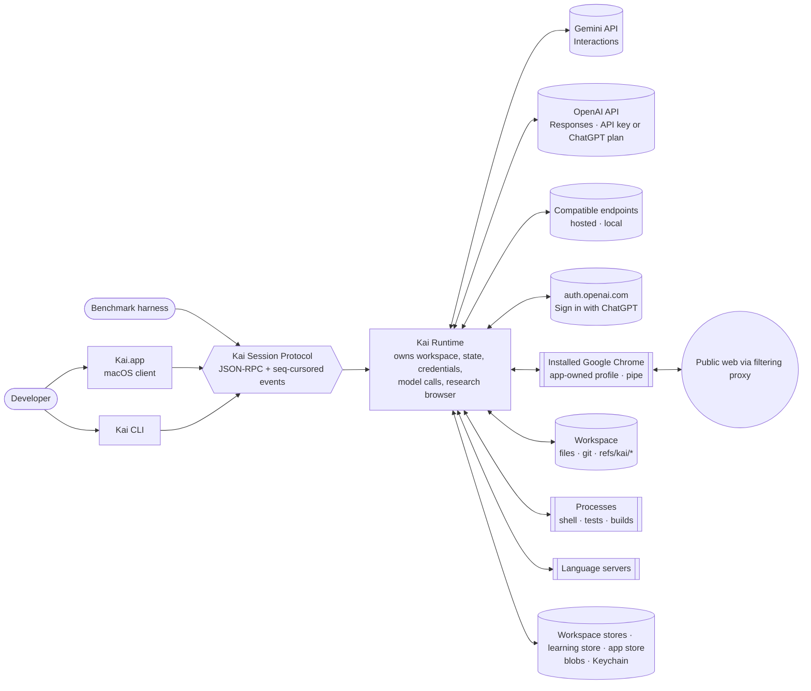
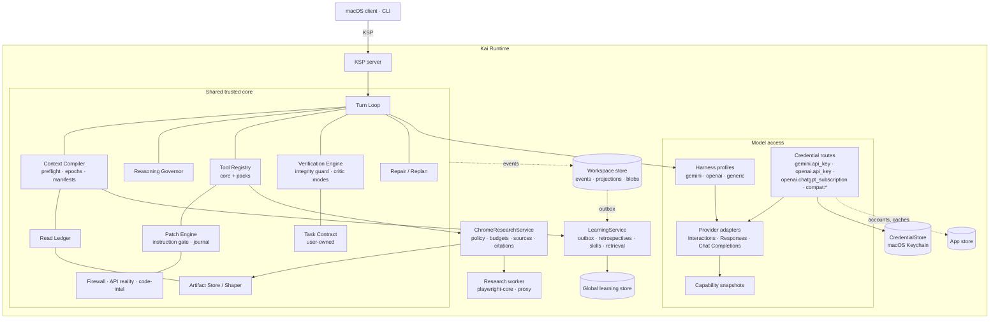
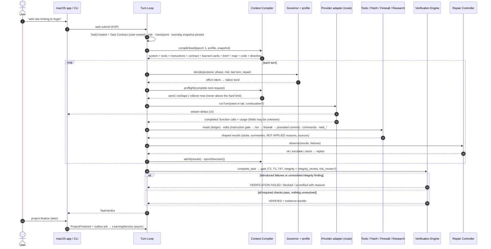
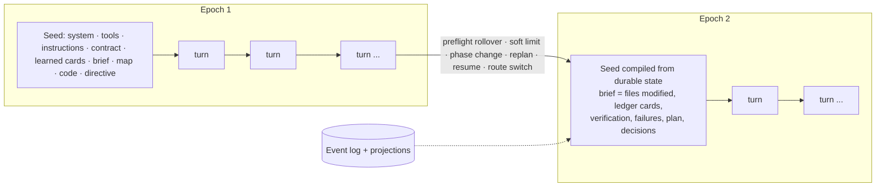
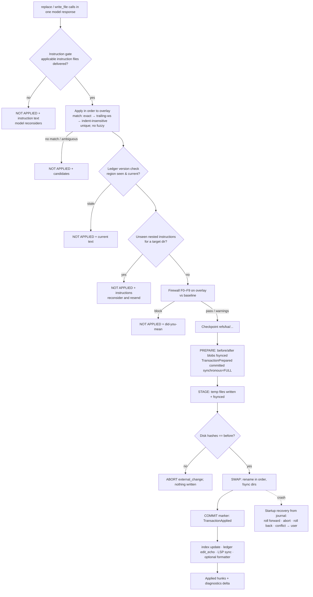
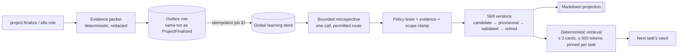

# Kai Agent: Architecture

> **Status:** proposed architecture (2026-10-05), extended for the R1 release scope
> ([ADR-0017](docs/adr/0017-release-scope-macos-multi-provider.md)). Decisions are recorded in [`docs/adr/`](docs/adr/), subsystem designs in
> [`docs/specs/`](docs/specs/), and the evidence in [`docs/research/`](docs/research/).

## 1. Goals and principles

Kai Agent is a **local macOS coding-agent app** built on a token-efficient, verification-first
runtime. Gemini is first-class through its native API; ChatGPT/OpenAI models are first-class
through the Responses API (API key or an eligible ChatGPT plan); user-configured
OpenAI-compatible endpoints get the same correctness protections with a generic profile.
Its measurable goals:

1. **Materially lower unnecessary token consumption**, per task and per comparable project.
2. **Materially reduce incorrect or hallucinated coding output.**
3. **Get cheaper on comparable projects over time without getting worse**, through measured
   procedural learning ([ADR-0022](docs/adr/0022-shared-procedural-learning.md)).

**Core philosophy:** *Give the model the smallest high-quality context it needs, and never
trust its own claim that the implementation is correct.*

Design principles ([synthesis](docs/research/synthesis.md), [extension research](docs/research/extension-2026-10.md)):

| # | Principle | Consequence |
|---|---|---|
| P1 | **The durable event log is the source of truth. Model context is a projection.** | Context can be cut aggressively without losing anything ([ADR-0004](docs/adr/0004-durable-event-session-model.md)) |
| P2 | **Control what enters the context. Don't rewrite it.** | Ingress gating within cache-friendly append-only epochs, deliberate epoch resets, and a preflight on every request ([ADR-0005](docs/adr/0005-context-compiler-and-epochs.md), [ADR-0016](docs/adr/0016-robustness-amendments.md)) |
| P3 | **Reject before write.** | Hallucination-class defects never reach the worktree ([firewall](docs/specs/hallucination-firewall.md)) |
| P4 | **Completion is a verified state, not a sentence.** | Only the Verification Engine can mark a task `verified`, for every route and profile ([ADR-0009](docs/adr/0009-verification-architecture.md)) |
| P5 | **Deterministic first, model second.** | Briefs, loop detection, risk, integrity, learning evidence and retrieval are deterministic. LLM calls (digest, critic, retrospective) are rare and budgeted |
| P6 | **Speak each provider natively; keep its quirks in its adapter and profile.** | Interactions for Gemini, Responses for OpenAI, probed dialects for compatible endpoints; core branches on capabilities only ([ADR-0018](docs/adr/0018-providers-routes-profiles-capabilities.md)) |
| P7 | **Every mechanism is measured and can be switched off.** | Ablation flags plus telemetry; mechanisms must win in the benchmark ([ADR-0014](docs/adr/0014-measurement-gated-mechanisms.md)) |
| P8 | **The runtime owns the workspace, credentials and browser. Clients only talk the protocol.** | Typed KSP boundary; the macOS renderer never sees a secret ([ADR-0002](docs/adr/0002-runtime-client-boundary.md), [ADR-0024](docs/adr/0024-macos-desktop-shell.md)) |
| P9 | **The user owns the requirements.** | A verbatim, append-only Task Contract that only user actions can amend. Model plans, learned skills and critic output are commentary, and weakening evidence needs a contract citation or user approval ([ADR-0015](docs/adr/0015-user-owned-task-contract.md)) |
| P10 | **Gates fail closed. Optional reviews may be skipped, mandatory ones may not.** | Established-only flakiness, journaled transactions with crash recovery, preflighted requests, pre-mutation instruction gate, reserved budget for mandatory integrity review ([ADR-0016](docs/adr/0016-robustness-amendments.md)) |
| P11 | **Untrusted input never becomes instruction or policy.** | Repository text, tool output and web pages are data; learning cannot promote policy-class lessons; workspace config is restrict-only |
| P12 | **Unknown stays unknown.** | Tri-state capabilities; unreported usage is `null`, never zero; savings are observations until a controlled evaluation |

## 2. System context



The macOS app hosts the runtime in an Electron `utilityProcess` and talks KSP over a
`MessagePort`. The CLI hosts it in-process (in-memory transport) or headless (stdio) for
development, automation and the benchmark.

## 3. Components



| Component | Responsibility (one line) | Spec |
|---|---|---|
| **Turn Loop** | Orchestrates model turns: decide effort, build the request, preflight it, stream, execute tools, admit results, observe for repair, apply epoch decisions | §5 below |
| **Task Contract** | The user's requirements, verbatim and append-only (only user actions amend it); the only authority for objective, acceptance and test-change authorization | [task-contract](docs/specs/task-contract.md) |
| **Harness profiles** | Model-facing behaviour per family: prompts, tool rendering, effort mapping, replay, context sizing, review and stop policy. Cannot relax any check | [harness-profiles](docs/specs/harness-profiles.md) |
| **Provider adapters** | Wire protocols, streaming, native items, error mapping, probes, capability snapshots | [gemini](docs/specs/gemini-provider.md), [openai](docs/specs/openai-responses-provider.md), [compatible](docs/specs/compatible-endpoints.md) |
| **Credential routes / CredentialStore** | Authorization, accounts, refresh, quota state and usage class per route; secrets only in the runtime | [credentials](docs/specs/credentials.md), [chatgpt-sign-in](docs/specs/chatgpt-sign-in.md) |
| **Context Compiler** | Budgeted epoch seeds, ingress admission, **request preflight**, epoch boundaries, deterministic briefs, instruction map, **complete request accounting**, local replay and provider chains, route switches | [context-compiler](docs/specs/context-compiler.md) |
| **Read Ledger** | What the model has seen (path or artifact, range, hash, epoch). Stubs, partial reads, diffs, staleness, edit version checks, instruction deliveries | [read-ledger](docs/specs/read-ledger.md) |
| **Artifact Store / Result Shaper** | Store every output in full, including web pages. Give the model parsed summaries plus excerpts. `read_artifact` on demand | [artifact-store](docs/specs/artifact-store.md) |
| **Repo Index / Map** | tree-sitter symbols, refs and imports. PageRank repo map. Symbol cards and outlines | [repo-index](docs/specs/repo-index.md) |
| **LSP Manager** | Lazy language servers, overlay documents, diagnostics deltas, name-addressed navigation, probe files | [ADR-0008](docs/adr/0008-code-intelligence-lsp.md) |
| **Tool Registry** | One typed registry for all profiles: core tools, capability packs (incl. `research`), execution order and parallelism | [tool-surface](docs/specs/tool-surface.md) |
| **Patch Engine** | Edit transactions: instruction gate, overlay, strict matching, ledger version checks, **write-ahead journaled** all-or-nothing commit, crash recovery, reverse patches | [patch-engine](docs/specs/patch-engine.md) |
| **Hallucination Firewall** | Pre-write checks F0–F9. Blocks hallucination-class findings, reports the rest | [hallucination-firewall](docs/specs/hallucination-firewall.md) |
| **API Reality Checker** | Library facts from lockfiles, installed packages, declarations and LSP probes, with provenance | [api-reality-checker](docs/specs/api-reality-checker.md) |
| **Verification Engine** | Task state machine, profile, tiers T0–T4, completion gate, baseline classification (established-only flakiness), evidence bundle; the same required checks on every route | [verification-engine](docs/specs/verification-engine.md) |
| **Test Integrity Guard** | Detects weakening of tests and verification config. Authorization only from contract citations or the user | [test-integrity-guard](docs/specs/test-integrity-guard.md) |
| **Repair / Replan Controller** | Failure and approach fingerprints, loop rules, budgets, clean replans | [repair-replan-controller](docs/specs/repair-replan-controller.md) |
| **Critic** | Fresh-context, evidence-validated review: optional **risk review** (skippable; evidence-bound blocking findings) and mandatory **integrity review** (reserved budget; unresolved → not verified) | [critic](docs/specs/critic.md) |
| **Reasoning Governor / Risk Assessor** | Effort intent per request from phase, risk and observed difficulty; the profile maps it to native levels | [reasoning-governor](docs/specs/reasoning-governor.md) |
| **Checkpoint Manager / Command Policy** | Hidden git-ref checkpoints with a private index. Command allow, ask or deny. Env sanitization | [ADR-0013](docs/adr/0013-workspace-safety-and-checkpoints.md) |
| **LearningService** | Project finalization, evidence packets, bounded retrospectives, scoped versioned skills, deterministic retrieval, controls | [learning-service](docs/specs/learning-service.md) |
| **ChromeResearchService** | Web search and page reading through the installed Chrome; policy, budgets, sources, citations, isolation | [chrome-research](docs/specs/chrome-research.md) |
| **Stores** | Workspace store (events, projections, blobs), global learning store, app store; no cross-store transactions | [event-model](docs/specs/event-model.md), [configuration](docs/specs/configuration.md) |
| **Telemetry** | Per-turn records, project resource ledger, reported vs estimated vs unknown | [telemetry](docs/specs/telemetry.md) |
| **KSP** | Typed, credential-free runtime ↔ client protocol with sequence cursors | [protocol](docs/specs/protocol.md) |
| **macOS client** | Electron shell: main process, sandboxed renderer, essential flows | [macos-client](docs/specs/macos-client.md) |

### Package layout (planned)

```
packages/
  protocol/            KSP schemas (Zod) and types: the only dependency of clients
  core/                domain: events/store, context, ledger, artifacts, tools, patch, firewall, verify,
                       integrity, repair, critic, governor, telemetry, turn loop; ports for providers,
                       profiles, credentials, learning and research (never their implementations)
  code-intel/          tree-sitter index, repo map, LSP manager, API reality checker
  provider-gemini/     Interactions adapter
  provider-openai/     Responses adapter (API-key and ChatGPT subscription request builders)
  provider-compatible/ Chat Completions (and probed Responses) adapter, probes
  profiles/            gemini, openai, generic harness profiles (pure data + functions over core types)
  research-chrome/     research worker: Chrome discovery and lifecycle, filtering proxy, SERP adapter, extraction
  runtime/             composition root: config and migration, stores, credential routes, SIWC, learning
                       service wiring, research policy, workspace (git, checkpoints, processes), KSP server
  cli/                 CLI client (protocol + runtime factory only)
  bench/               benchmark harness
apps/
  macos/               Electron main, preload, renderer (protocol only)
```

The [scaffold](packages/) contains **types only** for `protocol`, `core`, `provider-gemini`,
`provider-openai`, `provider-compatible`, `research-chrome` and `code-intel`.

## 4. End-to-end flow: from request to verified result



## 5. Turn Loop

```ts
async function runTask(task: Task) {
  checkpoint("task_start");
  pinLearningSnapshot(task);                       // LearningSnapshotPinned
  let epoch = startEpoch("task_start");            // Context Compiler builds the seed with the profile
  while (!task.isFinal()) {
    const effort = governor.decide(inputsFor(task, epoch));          // intent → native via profile
    let request = epoch.isFresh
      ? compiler.compileSeed(task, epoch)
      : compiler.continueRequest(epoch);           // provider_chain: new items + handle; local_replay: seed + tail
    const pf = compiler.preflight({ epoch, pending: request.input, lastResponse: epoch.lastUsage });
    if (pf.action === "rollover_now") {             // would exceed the hard limit: never send it
      epoch = startEpoch("hard_limit", { carriedResults: epoch.pendingIngress });
      continue;
    }
    if (pf.action === "reshape") request = { ...request, input: pf.reshaped };
    const response = await provider.runTurn({ ...request, effort, allowedTools: phaseRestriction(task) });
    if (response.error) { repair.onProviderError(response.error); continue; }   // route states pause the task

    const calls = response.functionCalls;          // only from a terminal "completed" event
    if (calls.length === 0) { handleTextOnly(task, response); continue; }

    const results = await tools.executeBatch(calls);   // reads ∥, edits as one transaction, shell sequential
    epoch.pendingIngress = await compiler.admit(results, epoch);
    repair.observe(task, results);
    if (repair.stuck(task)) epoch = repair.replan(task);
    else {
      const d = compiler.epochDecision(epoch, signals(response));    // incl. pending route switches
      if (d.action === "new_epoch") epoch = startEpoch(d.reason);
    }
  }
}
```

- **Text-only responses.** In interactive mode the text goes to the user (a question or a
  status). The task stays `in_progress` until the user replies. In headless mode, Kai adds a
  notice (*"No tool call: call complete_task if done, or continue"*). Two consecutive text-only
  turns → `blocked`.
- **Steering** messages from the user are appended to the Task Contract by the protocol
  handler, then queued and admitted as `user` ingress at the next turn (Pi's model).
- **Startup** runs journal crash recovery before the first turn
  ([patch-engine](docs/specs/patch-engine.md#crash-recovery)).
- **Cancellation**: `AbortSignal` propagates to the provider stream, running tools, research
  operations and verification. A transaction that has passed PREPARE is driven to its commit
  marker or rolled back. One that has not reached PREPARE never touches the worktree.
- **Route problems** (quota, re-auth, usage unavailable) pause the task as `blocked {route}`;
  resuming or switching route is always the user's explicit choice.

## 6. Context epochs



- **Within an epoch:** append-only, cache-friendly. Every addition passes the ledger and the
  shaper, and every request passes **preflight**, which projects its complete size (including
  carried model output) and reshapes or rolls over before a limit is crossed.
- **Across epochs:** a fresh, budgeted seed. Nothing is lost, because the log holds everything,
  and stale assumptions do not carry over unless the model recorded them as decisions or notes.
- **Continuation:** `provider_chain` (Gemini chained, OpenAI with stored responses) or
  `local_replay` (ChatGPT subscription, compatible endpoints, stateless modes; the seed stays
  byte-stable and the old tail is elided in batches), with tagged provider-native replay items
  that never cross a provider, route or account boundary.
- **Budgets** scale with the model's effective context window
  ([context sizing](docs/specs/harness-profiles.md#context-sizing)); Gemini keeps the founding
  numbers.

## 7. Edit transaction



A crash at any point is recovered from the write-ahead journal: fully applied, fully rolled back,
or blocked with a conflict report ([patch engine](docs/specs/patch-engine.md#crash-recovery)).

## 8. Verification gate

`complete_task` → `implemented_unverified` → **gate**: T2 (typecheck, lint, format) → T3
(related tests) → T4 (broad, risk-based) → baseline classification (introduced including
**intermittent**, pre-existing, **baseline-established** flaky, user-approved exceptions; never
"passed on rerun") → diff hygiene → Test Integrity Guard plus **mandatory resolution**
(contract citation, mandatory integrity review or user approval; unresolved → never verified) →
unfulfilled promissory symbols → **optional risk review** (skippable) → `verified`,
`verification_failed`, or `blocked` (`integrity_review_required`). Projects without runnable
checks end `implemented_unverified`, with reasons. Evidence is reported against the user-owned
Task Contract, with the same required checks for every route and profile. See the
[state machine](docs/specs/verification-engine.md#task-state-machine).

## 9. How the goals reinforce each other

| Efficiency mechanism | Correctness safeguard |
|---|---|
| Ledger stubs | Stubs only for **identical, currently visible** content. A changed region is always re-served (as a diff) and edits on stale views are rejected |
| Output spooling | Full output is stored and searchable. Parsers extract the exact failure messages. The readback rate exposes weak summaries |
| Epoch resets | Briefs are deterministic, built from projections (files modified, failures, verification). The contract is verbatim. Nothing is invented. Model notes are labelled |
| Preflight reshaping and rollover | Never drops instruction deliveries, `NOT APPLIED` reasons, verification failures or user messages. Cut content is spooled, not discarded |
| Savings estimates | Shown as calibrated only when complete request accounting reconciles with reported usage |
| Low effort for navigation | Escalation on observed difficulty (rejections, failures, repeats). The risk floor keeps high-risk tasks at ≥ medium; profiles may raise effort for architecture and hard repairs when it lowers total work |
| Small tool core | Code-intel, API and research packs activate when relevant. `read_symbol` is in the core |
| Learned procedures | Advisory cards under a hard budget, below the contract; policy-class lessons rejected; the gate is unchanged; savings must pass a predeclared quality bar |
| Bounded research | Typed outcomes; snippets are not evidence; citations must resolve to delivered excerpts |

| Correctness mechanism | How it avoids multiplying tokens |
|---|---|
| Firewall | Rejections are short (≤ 400 tokens) and prevent a wrong turn, plus later debugging turns that cost far more |
| Verification gate | Runs deterministic checks (zero model tokens). Green results are silent. Only introduced failures are shown, shaped |
| Repair controller | Stops loops early, so it *saves* tokens. A replan is one fresh, compact epoch |
| Critic | Risk review runs only on risk triggers, after deterministic checks pass, with a compact evidence bundle and its own budget. Integrity review is small (≤ 6k), reserved, and runs only for contract-backed high-severity test changes. Advisory findings never start rework; optional rounds are bounded per profile |
| Integrity guard | Deterministic AST checks and deterministic contract-citation checks. An LLM is involved only in the mandatory integrity review |
| Instruction gate | At most one extra turn per instruction file per epoch, usually zero (seeds and read-time delivery come first) |
| Baseline reruns and journal | Zero model tokens. Reruns only for failing tests. The journal costs disk I/O only |

## 10. Model routes, profiles and capability snapshots

[ADR-0018](docs/adr/0018-providers-routes-profiles-capabilities.md) separates four concepts:
**provider adapter** (wire protocol), **credential route** (authorization and usage class),
**harness profile** (model-facing behaviour) and **capability snapshot** (effective tri-state
support for this model, endpoint, route and account).

| Route | Adapter | Default profile | Usage class |
|---|---|---|---|
| `gemini.api_key` | Interactions | `gemini` | API metered |
| `openai.api_key` | Responses | `openai` | API metered |
| `openai.chatgpt_subscription` | Responses (subscription builder: `store: false`, `stream: true`, local replay, omitted fields) | `openai` | ChatGPT plan usage |
| `compat:<id>` | Chat Completions (Responses if probed) | `generic` | API metered or local compute |

The [profile comparison table](docs/specs/harness-profiles.md#comparison-of-profiles) shows the
differences; every profile shares the ledger, shaper, preflight, instruction gate, Patch Engine,
Firewall, gate, Integrity Guard with mandatory `integrity_review`, repair fingerprints, learning
and research.

## 11. Shared procedural learning



Details: [learning-service](docs/specs/learning-service.md),
[ADR-0022](docs/adr/0022-shared-procedural-learning.md).

## 12. Chrome research

`web_search`, `web_open` and `web_find` reach the **installed Google Chrome** through a research
worker (`playwright-core`, app-owned profile, `--remote-debugging-pipe`, filtering proxy).
Results are shaped artifacts with stable source IDs; citations must resolve to excerpts the model
actually received. Chrome is needed for research only. Details:
[chrome-research](docs/specs/chrome-research.md), [ADR-0023](docs/adr/0023-chrome-research.md).

## 13. Product surface

The macOS app (Electron: main process, sandboxed renderer, runtime in a `utilityProcess`) covers
workspace selection, provider/model/account setup, the endpoint doctor, task progress and
evidence, Chrome readiness and handoff, research citations, learning inspection and usage
reporting ([macos-client](docs/specs/macos-client.md), [ADR-0024](docs/adr/0024-macos-desktop-shell.md)).
The CLI stays for development, headless runs and the benchmark.

## 14. Configuration

Typed config (Zod), layered: built-in defaults → user (`$KAI_HOME/config.json`) → workspace
(`.kai/project.json`, committable, **restrict-only** for safety keys) → session/task (KSP) → CLI
flags. The founding Gemini-only config migrates automatically. Secrets live only in the
Keychain (or environment variables for API keys). Every threshold and ablation is a key.
Details: [configuration](docs/specs/configuration.md).

## 15. Cross-feature failure behaviour

Features fail independently wherever safe: quota exhaustion during reflection defers learning
without blocking completion; a Chrome failure during research leaves coding and installed-API
checks working; a provider change during repair keeps fingerprints and budgets; concurrent
finalizations produce one job each; a crash between verification and retrospective export
loses nothing. See [failure-modes §cross-feature](docs/failure-modes.md#cross-feature-failure-behaviour).

## 16. Deliberately not in R1

Multi-user or remote clients, an ACP adapter, OS sandboxing of commands, MCP, Go/Rust/Java LSP,
embeddings, multi-agent hierarchies, explicit Gemini caching, Windows and Linux desktop builds,
auto-installing dependencies, unrestricted browser automation, model-native hosted tools as a
dependency, and a broad UI redesign.
