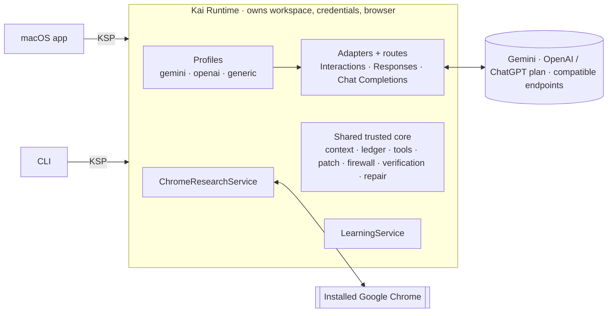

# Kai Agent

**A local macOS coding agent that gives the model the smallest high-quality context it needs,
never trusts its claim that the code is correct, and gets cheaper on comparable projects without
getting worse.**

> ### Status: architecture and design only
> **Production implementation has not begun.** This repository contains a researched
> architecture, decision records, subsystem specifications, a failure-mode analysis, an
> evaluation plan and a **types-only scaffold**. The implementation is planned in
> [IMPLEMENTATION_PLAN.md](IMPLEMENTATION_PLAN.md). The R1 release scope (below) was added by
> [ADR-0017](docs/adr/0019-release-scope-macos-multi-provider.md).

## Why

Strong agentic coding models show two recurring weaknesses in autonomous harnesses:

1. **Unnecessary token consumption**: re-reading unchanged files, ingesting too much of the
   repository, carrying stale history, injecting huge tool outputs, exposing irrelevant tool
   schemas, maximum reasoning on trivial steps, and rediscovering on every project what the
   last comparable project already learned. Two widely used open harnesses, Gemini CLI and
   OpenCode, hard-code maximum thinking for Gemini ([evidence](docs/research/gemini-api.md#6-thinking-reasoning-effort)).
2. **Low-confidence or hallucinated code**: invented APIs and symbols, misread interfaces, code
   that does not typecheck, broad unnecessary edits, weakened tests, premature "done" claims,
   and repair loops around a flawed approach.

Kai **disciplines** the model: it controls what enters the context, checks proposed code against
repository reality before it is written, decides completion from deterministic evidence, and
learns procedures from verified outcomes rather than from the model's opinion of itself.

## R1 release scope

| | Feature | Spec |
|---|---|---|
| 🍎 | **macOS app** as the product surface (the CLI stays for development and benchmarks) | [macos-client](docs/specs/macos-client.md) |
| ♊ | **Gemini, first-class**: native Interactions API, dedicated profile | [gemini-provider](docs/specs/gemini-provider.md) |
| 🔐 | **Sign in with ChatGPT**: the documented open-source flow; eligible plan usage, separate from API spend | [chatgpt-sign-in](docs/specs/chatgpt-sign-in.md) |
| 🤖 | **ChatGPT/OpenAI, first-class**: Responses API with native replay; a profile that permits deep reasoning where it pays and stops optional review once requirements are met | [openai-responses-provider](docs/specs/openai-responses-provider.md), [harness-profiles](docs/specs/harness-profiles.md) |
| 🔌 | **OpenAI-compatible endpoints**, hosted and local, probed rather than assumed | [compatible-endpoints](docs/specs/compatible-endpoints.md) |
| 🧰 | **A strong generic profile**: fewer vendor optimizations, the same correctness protections | [harness-profiles](docs/specs/harness-profiles.md) |
| 🧠 | **Shared procedural learning**: project retrospectives and scoped skills that must lower total resources at equal or better quality | [learning-service](docs/specs/learning-service.md) |
| 🌐 | **Research through your installed Google Chrome**: search, open, find; cited, isolated, budgeted; shared by every profile | [chrome-research](docs/specs/chrome-research.md) |

## What makes Kai different

| | Mechanism | Effect |
|---|---|---|
| 🧾 | **Read Ledger** | Knows what source the model has seen (path, range, hash, epoch). Unchanged content is never re-sent, and stale views are detected |
| 📦 | **Artifact spooling** | Full outputs are stored. The model gets parsed summaries and excerpts, and can query the rest on demand |
| 🧭 | **Context Compiler with epochs and preflight** | Budgeted, cache-friendly seeds from durable state; every request sized before it is sent, for 1M-token and 32k-token windows alike |
| 🗺️ | **Repo map and symbol tools** | tree-sitter + PageRank map, symbol cards, `read_symbol`: search → resolve → narrow read |
| 🧱 | **Hallucination Firewall** | Rejects invented symbols, members and imports, parse errors and omission placeholders **before** they are written |
| 📚 | **API Reality Checker** | Library API facts from the installed versions' declarations, not from model memory or the web |
| ✅ | **Verification Engine** | Tiered checks, baseline-aware failures, an explicit state machine. "Done" means `verified` with evidence, on every route |
| 🧪 | **Test Integrity Guard** | Detects skipped, deleted, weakened or suppressed tests; mandatory reviews cannot be budgeted away |
| 🔁 | **Repair/Replan Controller** | Failure fingerprints stop retry loops. A clean replan happens in a fresh context |
| 🧠 | **Reasoning Governor + profiles** | Effort per request from phase, risk and observed difficulty, mapped to each model's own levels |
| 🔍 | **Evidence-bound critic** | Blocking findings need a violated requirement or a reproduced defect; style preferences never trigger rework |
| 📊 | **Telemetry** | Reported vs estimated vs unknown tokens; usage by purpose and route class (API spend, plan usage, local compute) |

## Architecture at a glance

Read [ARCHITECTURE.md](ARCHITECTURE.md) for the full design and runtime flow.

## Repository guide

| Path | Contents |
|---|---|
| [ARCHITECTURE.md](ARCHITECTURE.md) | End-to-end architecture, components, flows, principles |
| [IMPLEMENTATION_PLAN.md](IMPLEMENTATION_PLAN.md) | Phased roadmap with acceptance criteria, vertical slices and release gates |
| [AGENTS.md](AGENTS.md) | Rules and workflow for coding agents implementing Kai |
| [docs/research/](docs/research/) | Primary-source studies: Gemini API, 12 open-source projects, and the [release extension research](docs/research/extension-2026-10.md) |
| [docs/adr/](docs/adr/) | 23 architecture decision records |
| [docs/specs/](docs/specs/) | 26 subsystem specifications |
| [docs/failure-modes.md](docs/failure-modes.md) | 50 failure modes and cross-feature failure behaviour |
| [docs/evaluation/](docs/evaluation/) | Benchmark plan (incl. profile, learning and research evaluations) and corpus design |
| [docs/glossary.md](docs/glossary.md) | Terms used across the docs |
| [packages/](packages/) | **Types-only scaffold** (not an implementation) |

## Key decisions (summary)

- **TypeScript on Node.js 24**; first-party SDKs where they exist. [ADR-0001](docs/adr/0001-implementation-language-runtime.md)
- **Append-only SQLite event log. Model context is a projection.** [ADR-0004](docs/adr/0004-durable-event-session-model.md)
- **Epochs: budgeted seeds plus ingress control**, with a preflight on every request. [ADR-0005](docs/adr/0005-context-compiler-and-epochs.md), [ADR-0016](docs/adr/0018-robustness-amendments.md)
- **Adapters, credential routes, harness profiles and capability snapshots are separate**; core branches on capabilities only. [ADR-0018](docs/adr/0020-providers-routes-profiles-capabilities.md)
- **Sign in with ChatGPT through the documented open-source flow only**; no borrowed client IDs or private routes. [ADR-0019](docs/adr/0021-sign-in-with-chatgpt-route.md)
- **Learning is per finalized project, deterministic in evidence and retrieval, and outcome-gated.** [ADR-0022](docs/adr/0024-shared-procedural-learning.md)
- **Research drives the installed Chrome** through `playwright-core`, an app-owned profile and a filtering proxy. [ADR-0023](docs/adr/0016-chrome-research.md)
- **Electron shell, runtime in a separate process, KSP over `MessagePort`.** [ADR-0024](docs/adr/0024-macos-desktop-shell.md)
- **Every mechanism must win in the benchmark** to stay on by default. [ADR-0014](docs/adr/0014-measurement-gated-mechanisms.md)

## Non-goals (R1)

Enterprise workflow orchestration, multi-agent hierarchies, becoming an IDE, recreating GitHub,
cloud infrastructure, multi-user or remote clients, MCP/plugin sprawl, unrestricted browser
automation (purchases, posting, account logins), model-native hosted tools as a dependency,
Windows and Linux desktop builds, and a broad UI redesign.

## License and distribution

To be decided by the repository owner. Upstream projects studied here are used as architectural
inspiration only ([licensing summary](docs/research/README.md#licensing-summary)). The ChatGPT
subscription route is documented for open-source projects, personal projects that run locally,
and approved apps; Kai currently assumes **personal local use** only and does not change its
licence or distribution on the owner's behalf ([ADR-0019](docs/adr/0021-sign-in-with-chatgpt-route.md)).
