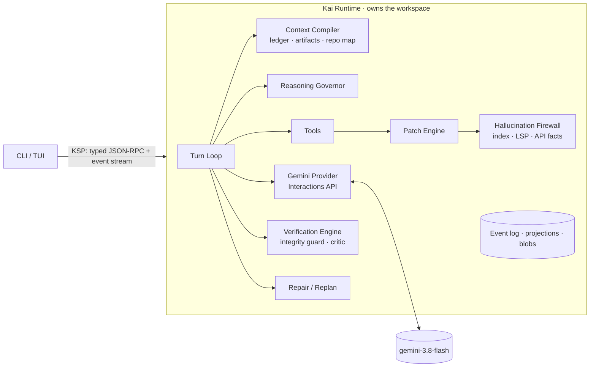

# Kai Agent

**A Gemini-first coding-agent harness that gives the model the smallest high-quality context it
needs, and never trusts its claim that the code is correct.**

> ### Status: architecture and design only
> **Production implementation has not begun.** This repository currently contains a
> researched architecture, decision records, subsystem specifications, a failure-mode analysis,
> an evaluation plan and a **types-only scaffold**. The implementation is planned in
> [IMPLEMENTATION_PLAN.md](IMPLEMENTATION_PLAN.md).

## Why

Gemini 3.8 Flash (`gemini-3.8-flash`) is a strong agentic coding model. In autonomous coding
harnesses it shows two recurring weaknesses:

1. **Unnecessary token consumption**: re-reading unchanged files, ingesting too much of the
   repository, carrying stale history, injecting huge tool outputs, exposing irrelevant tool
   schemas, maximum reasoning effort on trivial steps, and rediscovering facts the harness
   already knows. Two widely used open harnesses we inspected, Gemini CLI and OpenCode, hard-code
   maximum thinking for Gemini ([evidence](docs/research/gemini-api.md#6-thinking-reasoning-effort)).
2. **Low-confidence or hallucinated code**: invented APIs and symbols, misread interfaces,
   imports of nonexistent exports, code that does not typecheck, broad unnecessary edits,
   weakened tests, premature "done" claims, and repair loops around a flawed approach.

Kai is a harness that **disciplines** the model: it controls what enters the context, checks
proposed code against repository reality before it is written, and decides completion from
deterministic evidence.

## Intended users

- Developers and small teams who use Gemini for autonomous or semi-autonomous coding in
  **TypeScript/JavaScript and Python** repositories and care about **cost** and **trust**.
- Engineers who want **measured** answers about what a harness changes, with per-turn token and
  correctness telemetry and a reproducible benchmark.

## What makes Kai different

| | Mechanism | Effect |
|---|---|---|
| 📜 | **User-owned Task Contract** | The user's requirements are stored verbatim and can be amended only by the user. The model cannot rewrite the exam: weakening a test needs a quote of the user's words or the user's approval |
| 🧾 | **Read Ledger** | Knows what source the model has seen (path, range, hash, epoch). Unchanged content is never re-sent, and stale views are detected |
| 📦 | **Artifact spooling** | Full outputs are stored. The model gets parsed summaries and excerpts, and can query the rest on demand |
| 🧭 | **Context Compiler with epochs** | Budgeted, cache-friendly seeds compiled from durable state, with deterministic epoch briefs instead of lossy summaries. Every request is **preflighted** (never sent above the hard limit) and **fully accounted**, including model-generated history |
| 🗺️ | **Repo map and symbol tools** | tree-sitter + PageRank map, symbol cards, `read_symbol`: search → resolve → narrow read |
| 🧱 | **Hallucination Firewall** | Rejects invented symbols, members and imports, parse errors and omission placeholders **before** they are written, and lists what really exists |
| 🗂️ | **Instruction gate** | Nested `AGENTS.md`-style rules are discovered up front. No edit lands in a directory until its rules are in Gemini's context |
| 💾 | **Journaled transactions** | Multi-file edits are all-or-nothing, with a write-ahead journal and deterministic crash recovery |
| 📚 | **API Reality Checker** | Library API facts from the installed versions' declarations, not from model memory |
| ✅ | **Verification Engine** | Tiered checks, baseline-aware failures, an explicit state machine. "Done" means `verified` with evidence. "Passed on rerun" never excuses a new intermittent failure |
| 🧪 | **Test Integrity Guard** | Detects skipped, deleted, weakened or suppressed tests and checks. Only the user's contract or the user can authorize them |
| 🔁 | **Repair/Replan Controller** | Failure fingerprints stop retry loops. A clean replan happens in a fresh context |
| 🧠 | **Reasoning Governor** | `thinking_level` per request from phase, risk and observed difficulty |
| 🔍 | **Selective critic** | A fresh-context, evidence-validated review: optional for risky changes, **mandatory** (with a reserved budget) for contract-backed high-severity test changes |
| 📊 | **Telemetry** | Reported vs estimated tokens, context composition per category, savings and correctness counters |

All of these are designed around **Gemini's native Interactions API** (chained state per
epoch, implicit caching, `thinking_level`, typed steps), not an OpenAI-compatible shim.

## Architecture at a glance

Read [ARCHITECTURE.md](ARCHITECTURE.md) for the full design and runtime flow.

## Repository guide

| Path | Contents |
|---|---|
| [ARCHITECTURE.md](ARCHITECTURE.md) | End-to-end architecture, components, flows, principles |
| [IMPLEMENTATION_PLAN.md](IMPLEMENTATION_PLAN.md) | Phased roadmap with acceptance criteria and vertical slices |
| [AGENTS.md](AGENTS.md) | Rules and workflow for coding agents implementing Kai |
| [docs/research/](docs/research/) | Primary-source studies of the Gemini API and 12 open-source projects, a comparison matrix and a synthesis |
| [docs/adr/](docs/adr/) | 16 architecture decision records (including design-review amendments) |
| [docs/specs/](docs/specs/) | 18 subsystem specifications |
| [docs/failure-modes.md](docs/failure-modes.md) | 31 failure modes: detection, containment, recovery |
| [docs/evaluation/](docs/evaluation/) | Benchmark plan (Kai vs minimal harness vs Gemini CLI) and corpus design |
| [docs/glossary.md](docs/glossary.md) | Terms used across the docs |
| [packages/](packages/) | **Types-only scaffold** (not an implementation) |

## Key decisions (summary)

- **TypeScript on Node.js 24**, using `@google/genai` (first-party, with generated Interactions
  types). [ADR-0001](docs/adr/0001-implementation-language-runtime.md)
- **Interactions API, chained state per epoch**, with a stateless privacy mode and runtime
  capability probing. [ADR-0003](docs/adr/0003-gemini-provider-strategy.md)
- **Append-only SQLite event log. Model context is a projection.** [ADR-0004](docs/adr/0004-durable-event-session-model.md)
- **Epochs: budgeted seeds plus ingress control**, not per-turn recompilation (which would
  defeat Gemini caching). [ADR-0005](docs/adr/0005-context-compiler-and-epochs.md)
- **Gemini-CLI-shaped core tools** (in-distribution), a small stable core, and capability packs
  at epoch boundaries. [ADR-0012](docs/adr/0012-tool-surface-and-dynamic-exposure.md)
- **Every mechanism must win in the benchmark** to stay on by default. [ADR-0014](docs/adr/0014-measurement-gated-mechanisms.md)
- **The user owns the requirements**: a verbatim, append-only Task Contract that model plans
  cannot change or override. [ADR-0015](docs/adr/0015-user-owned-task-contract.md)
- **Gates fail closed**: established-only flakiness, journaled transactions with crash recovery,
  request preflight, complete accounting, a pre-mutation instruction gate, and mandatory integrity
  review that is never skipped for budget. [ADR-0016](docs/adr/0016-robustness-amendments.md)

## Non-goals (v1)

Enterprise workflow orchestration, multi-agent hierarchies, becoming an IDE, recreating GitHub,
cloud infrastructure, many providers, MCP/plugin sprawl, and autonomous browsing.

## License

To be decided by the repository owner. Upstream projects studied here are used as architectural
inspiration only. See [docs/research/README.md#licensing-summary](docs/research/README.md#licensing-summary).
