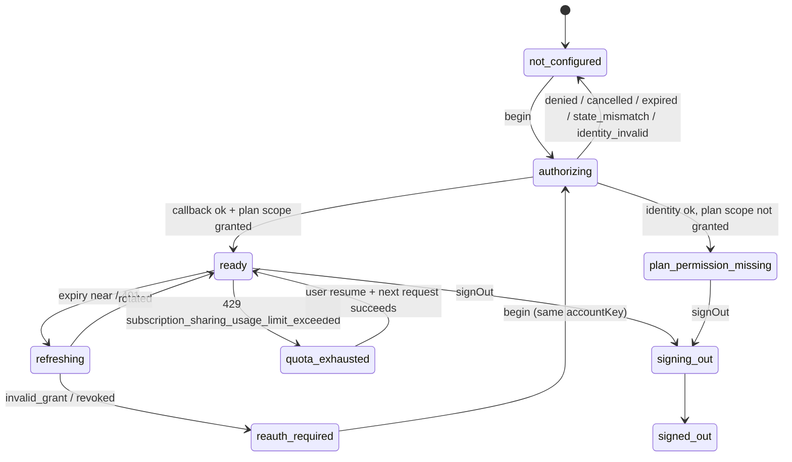

# Spec: Sign in with ChatGPT (subscription credential route)

- Package: `packages/runtime` (`auth/chatgpt/`), types in `packages/core/src/credentials.ts`
- Decision: [ADR-0017](../adr/0017-sign-in-with-chatgpt-route.md)
- Research: [extension research §2](../research/extension-2026-10.md#2-sign-in-with-chatgpt-for-open-source-and-local-apps-r2r10) (open questions O1–O9)
- Collaborators: [credentials](credentials.md), [OpenAI Responses provider](openai-responses-provider.md), [macOS client](macos-client.md), [protocol](protocol.md)

## Responsibility

Implement the **documented open-source Sign in with ChatGPT flow** so a user with an eligible
ChatGPT plan can authorize Kai to make plan-backed Responses requests, and manage that
authorization (refresh, switch, sign out) without secrets leaving the runtime.

**Not responsible for:** inference (the [Responses provider](openai-responses-provider.md)),
identity-only login (Kai has no user accounts), or anything in the ChatGPT product (Kai never
reads conversations, memories or account context, and never calls private ChatGPT backend routes
or reuses another application's client ID).

## Eligibility gate

| `release.distribution` | Route available | Requirement |
|---|---|---|
| `personal_local` (default for source builds) | yes | The owner runs Kai locally for personal use |
| `open_source` | yes | The owner has published Kai under an open-source licence (not set by this ticket) |
| `commercial_approved` | yes | An OpenAI-issued client registration for the commercial programme is configured |
| `commercial_unapproved` | **no** (`disabled {distribution_ineligible}`) | Paid or hosted distribution without approval |

Release builds set the value at build time; it cannot be changed from the renderer. The terms
(open question O9) must be re-read by the owner before any public release.

## Identifiers and persisted state

| Item | Where | Shape |
|---|---|---|
| **Host identity** (`ext_agent_host_id`) | `<KAI_HOME>/identity/host.json` (0600), created once at first run | `{v: 1, extAgentHostId: base64url(32 random bytes), createdAt}`. Opaque; no user data; not a secret; survives sign-out; regenerated only by `kai reset --identity` |
| **Account registration** | App store (`<KAI_HOME>/app.db`) `accounts` table | `{accountKey, issuedClientId, accountLabel (masked), workspaceLabel?, createdAt, lastSignInAt}`. `accountKey = sha256(sub ‖ workspaceClaim?)` |
| **Token set** | Keychain item per account (`CredentialRef`) | `{access_token, refresh_token, id_token, expires_at, earliest_refresh_at?, granted_scope}` |
| **OIDC discovery cache** | App store, TTL 24 h | Issuer metadata, JWKS (keys only), fetched over HTTPS from `https://auth.openai.com/.well-known/openid-configuration` |

The host identity is **not** an OAuth client registration. Client registrations are per ChatGPT
account and issued by OpenAI.

## Sign-in flow

```mermaid
sequenceDiagram
  autonumber
  actor U as User
  participant App as macOS app (renderer)
  participant RT as Runtime
  participant B as Default browser
  participant A as auth.openai.com
  U->>App: "Continue with ChatGPT" (explains identity + plan usage)
  App->>RT: auth.chatgpt.begin {accountKey?}
  RT->>RT: attempt = {id, state, nonce, verifier, challenge=S256(verifier), expires=+10m}
  RT->>RT: listen 127.0.0.1:<port> path /callback (single attempt)
  RT-->>App: {attemptId, authorizeUrl}
  App->>B: open authorizeUrl (main process, allowlisted origin)
  B->>A: authorize (client_id = issued id or dynamic_agent_client, scopes, PKCE, state, nonce, host id)
  A-->>U: consent: identity + plan usage
  A->>RT: 302 http://127.0.0.1:<port>/callback?code&state&<issued client id>
  RT->>RT: validate state; persist registration (issued client id) BEFORE exchange
  RT->>A: POST token (code, verifier, issued client_id, redirect_uri, resource)
  A-->>RT: access, refresh, id_token, scope, expires_in
  RT->>RT: validate ID token + granted scope; store tokens in Keychain
  RT-->>App: event RouteStateChanged → ready | plan_permission_missing
```

### Authorization request

`GET <authorization_endpoint>` (discovered; documented value
`https://auth.openai.com/api/accounts/authorize`) with:

| Parameter | Value |
|---|---|
| `response_type` | `code` |
| `client_id` | `dynamic_agent_client` for a new account; the saved **issued** client ID when re-signing in to a known account (`accountKey` given) |
| `agent_name_hint` | `Kai` (only with `dynamic_agent_client`) |
| `ext_agent_host_id` | host identity (only with `dynamic_agent_client`) |
| `redirect_uri` | `http://127.0.0.1:<port>/callback`, byte-identical in the token request |
| `scope` | `openid profile email offline_access resource.invoke chatgpt.tokens.use.direct` |
| `resource` | `https://api.openai.com/v1` |
| `state` | base64url(32 random bytes), single-use |
| `nonce` | base64url(32 random bytes), single-use |
| `code_challenge`, `code_challenge_method` | base64url(SHA-256(verifier)), `S256`; verifier = base64url(32 random bytes) |

The consent screen is OpenAI's. Kai's own pre-sign-in screen states, before opening the browser:
what identity data Kai receives (name, email, picture), that plan usage counts against the
user's ChatGPT plan and app limits, that Kai does not access ChatGPT conversations or memories,
and how to revoke access later.

### Loopback listener

- Binds `127.0.0.1` only (never `0.0.0.0` or `localhost` name resolution), on an ephemeral port
  (O1: a fixed configurable port `auth.chatgpt.callbackPort` if ephemeral is rejected).
- Serves exactly one path, `/callback`, for exactly one attempt; any other path returns 404;
  a second callback for the same attempt returns 400 and is ignored.
- Closes on success, failure, cancellation or expiry (10 minutes).
- Responds to the browser with a static page ("You can return to Kai") that contains no token
  or code.

### Callback validation (in order; first failure ends the attempt)

| Check | Failure → attempt result |
|---|---|
| `error` parameter present | `access_denied` → `denied` (user declined); other codes → `failed {error}` |
| `state` equals the attempt's state (constant-time) and attempt not expired | `state_mismatch` (possible CSRF; no exchange) |
| `code` present | `failed {missing_code}` |
| Issued client ID present (parameter name per O2) when `dynamic_agent_client` was used | `failed {registration_missing}` |

Then the registration `{pendingAccount, issuedClientId}` is persisted **before** the code
exchange, as the documentation requires.

### Token exchange and validation

`POST <token_endpoint>` (documented `https://auth.openai.com/api/accounts/oauth/token`),
form-encoded: `grant_type=authorization_code`, `code`, `redirect_uri`, `client_id` (issued),
`code_verifier`, `resource=https://api.openai.com/v1`. No client secret.

| Check | Rule | Failure |
|---|---|---|
| Response shape | `access_token`, `refresh_token`, `id_token`, `token_type` = `Bearer` (case-insensitive), `expires_in` > 0, `scope` | `failed {token_response_invalid}` |
| ID token signature | JWS verified with a key from the discovered `jwks_uri`; `alg` ∈ {`RS256`, `ES256`, `PS256`}; `none` and `HS*` rejected; unknown `kid` → refetch JWKS once | `identity_invalid {signature}` |
| `iss` | equals the discovered issuer, which must equal `https://auth.openai.com` | `identity_invalid {issuer}` |
| `aud` | contains the issued client ID (O2) | `identity_invalid {audience}` |
| `exp`, `iat` | `exp` > now − 60 s; `iat` ≤ now + 60 s | `identity_invalid {expired}` |
| `nonce` | equals the attempt's nonce | `identity_invalid {nonce}` |
| Account key | derived from `sub` and the workspace claim (O3). When re-signing into a known `accountKey`, it must match | `account_mismatch` (tokens discarded; the user is told which account signed in) |
| Granted scope | contains `chatgpt.tokens.use.direct` | Tokens stored, route state `plan_permission_missing`; no inference |

Only after all checks pass are tokens written to the Keychain (`CredentialStore.put`) and the
route set to `ready`. The `earliest_refresh_at` value, if present, is respected.

## Refresh

- Triggered when the access token expires within 120 s, or after a 401 with
  `invalid_token`/expired semantics on an inference request.
- **Single-flight per account**: an in-process mutex plus a cross-process lock file
  `<KAI_HOME>/locks/cred-<ref>.lock` (the app and a CLI runtime may both hold the route).
  Concurrent callers await the same refresh.
- Request: `POST <token_endpoint>` with `grant_type=refresh_token`, issued `client_id`,
  `refresh_token`, `resource=https://api.openai.com/v1`; `scope` omitted.
- The new token set is written with `compareAndSwap` on the stored version **before** the new
  access token is used. If the swap reports `conflict` (another process refreshed first), the
  caller re-reads the store and uses the stored set.
- `invalid_grant` or a revoked-token error → `reauth_required {refresh_rejected | revoked}`;
  in-flight requests on the route fail with a typed error; the task pauses (`blocked {route}`).
- Network failure → retry with backoff (1 s, 4 s, 16 s); the route reports `refreshing` meanwhile.

## Accounts and switching

- Multiple ChatGPT accounts may be stored; one is **selected** per session (`session.create
  {routeId, accountKey}`) and inherited by its tasks.
- Switching the account of a running task is a **route switch** at a safe boundary: the current
  turn completes or is cancelled, provider-native replay items tagged with the old
  `accountScope` are dropped, and a new epoch is compiled from durable state
  ([context compiler](context-compiler.md#provider-and-route-switches)).
- Signing in to a known account that returns a different account identity is reported as
  `account_mismatch`; it is never merged with the known account.

## Sign-out

1. Route → `signing_out`; new requests on it are refused; in-flight streams are aborted (turns
   recorded as `cancelled`, tasks paused, never lost).
2. `POST <revocation_endpoint>` (discovered) with `token=<refresh_token>`,
   `token_type_hint=refresh_token`, issued `client_id`. HTTP 200 (including an already-invalid
   token) → `revocation: confirmed`. Timeout, network error or other status → `unconfirmed`.
3. Delete the token set from the Keychain. Keep the host identity and the account→client
   registration.
4. Route → `signed_out {revocation}`. The app says plainly when revocation was not confirmed and
   links to ChatGPT's connected-apps settings.

## Branding and UI

- Button label **"Continue with ChatGPT"** in the provider setup screen, placed with the other
  route options (API key, compatible endpoint). Logo assets from the official quickstart page
  only, at the documented sizes (retrieved in Phase 11).
- The route card shows: account label (masked email), workspace label if known, "Plan usage:
  ready / permission missing / limit reached", last refresh, and **Sign out**.
- The browser step is always the user's **default browser** through the main process.
  It never uses Kai's automated research profile, and research availability is never a
  prerequisite for sign-in.

## KSP

`auth.chatgpt.begin {accountKey?}` → `{attemptId, authorizeUrl}`;
`auth.chatgpt.cancel {attemptId}`; `auth.chatgpt.status` → accounts with `RouteState`;
`auth.chatgpt.signOut {accountKey}` → `{revocation}`; `auth.chatgpt.select {sessionId, accountKey}`.
Events: `AuthAttemptStarted {attemptId}`, `AuthAttemptFinished {attemptId, result}`,
`RouteStateChanged`. None contains codes, tokens, state, nonce or verifier values.

## State machine (route instance per account)



## Telemetry

Attempts by result (`ok`, `denied`, `cancelled`, `expired`, `state_mismatch`,
`identity_invalid:*`, `account_mismatch`, `plan_permission_missing`), refresh counts and
failures, revocation confirmed vs unconfirmed. No identifiers beyond `accountScope` hashes.

## Acceptance tests

Offline, against a **fake authorization server** (local HTTPS with a test CA, test JWKS):

1. Happy path, new account: `dynamic_agent_client`, `agent_name_hint=Kai` and the host ID are
   sent; the issued client ID is persisted before the token request (assert ordering); tokens
   land only in the in-memory test store; route `ready`.
2. **State mismatch:** callback with a different `state` → no token request is made; result
   `state_mismatch`; listener closed.
3. **Nonce mismatch / wrong issuer / wrong audience / `alg: none` / expired ID token** → each
   gives `identity_invalid {…}`; nothing stored.
4. **Denied consent:** `error=access_denied` → `denied`; route stays `not_configured`.
5. **Plan consent denied:** granted scope lacks `chatgpt.tokens.use.direct` → route
   `plan_permission_missing`; an inference attempt fails with a typed error and no HTTP request.
6. **Cancellation and expiry:** `auth.chatgpt.cancel` and the 10-minute expiry both close the
   listener; a late callback gets 400.
7. **Account switching:** re-sign-in with `accountKey` A returning account B → `account_mismatch`;
   A's tokens unchanged.
8. **Refresh race:** 20 concurrent requests with an expired token in two runtime processes →
   exactly one refresh request reaches the fake server; both processes use the rotated token.
9. **Revocation:** sign-out with the fake revocation endpoint up → `confirmed`; down →
   `unconfirmed`, tokens still deleted, UI string asserts the honest wording.
10. **Revoked access mid-task:** refresh returns `invalid_grant` → `reauth_required`; the task is
    `blocked {route}` with state intact; no other route is used.
11. **Secret hygiene:** event log, logs and KSP traffic of tests 1–10 contain none of the fake
    code, tokens, state, nonce or verifier values.

Live (gated `test:live-auth`; requires macOS, a real eligible ChatGPT account and an
interactive browser; never claimed as passing without them): O1–O3 measurements, a real
sign-in, refresh, model catalog listing and sign-out with confirmed revocation.
