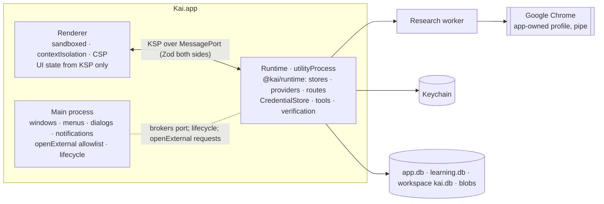

# Spec: macOS client and runtime hosting

- Packages: `apps/macos` (Electron main, preload, renderer; planned), `packages/runtime` (hosted in a `utilityProcess`), `packages/protocol`
- Decision: [ADR-0022](../adr/0022-macos-desktop-shell.md), [ADR-0002](../adr/0002-runtime-client-boundary.md)
- Collaborators: [protocol](protocol.md), [credentials](credentials.md), [Sign in with ChatGPT](chatgpt-sign-in.md), [compatible endpoints](compatible-endpoints.md), [Chrome research](chrome-research.md), [learning](learning-service.md), [telemetry](telemetry.md), [configuration](configuration.md)

## Responsibility

Be the product surface: let a user pick a workspace, set up model routes, run and observe tasks,
inspect evidence, research citations, learning and usage, all through **KSP only**. Host the
runtime in a separate process and keep secrets, filesystem access, browser control and provider
calls out of the UI.

**Not responsible for:** any agent logic, file access, credential handling or network calls
other than opening allowlisted URLs in the default browser. A broad UI redesign is out of scope;
this spec fixes boundaries and essential flows.

## Process model



| Process | May | Must not |
|---|---|---|
| Main | Create windows; show native folder pickers and notifications; open URLs from the allowlist (`https://auth.openai.com/`, `https://chatgpt.com/` settings pages, `https://www.google.com/chrome/`) in the default browser; start, monitor and restart the runtime | Read KSP payloads, hold secrets, touch workspaces, make model or web requests |
| Renderer | Render snapshot + events; send KSP requests | Use Node, `require`, `fs`, network (CSP `default-src 'self'`; `connect-src 'none'`), receive secrets |
| Runtime | Everything in the runtime specs | Render UI, open windows |

**Preload API** (the whole surface):

```ts
// exposed via contextBridge as window.kai
interface KaiPreload {
  connect(): Promise<MessagePort>;              // a fresh KSP port to the runtime
  pickFolder(): Promise<string | null>;         // native dialog in main; the runtime validates the path
  openExternal(url: string): Promise<boolean>;  // main checks the allowlist; false if refused
  appInfo(): { version: string; arch: "arm64" };
}
```

Renderer windows refuse navigation (`will-navigate` and `setWindowOpenHandler` deny) and load
only the packaged UI.

## KSP over MessagePort

A `MessagePortTransport` joins the existing in-memory and stdio transports
([protocol](protocol.md#transport-and-framing)). Messages are the same JSON-RPC objects,
validated with the same Zod schemas on both ends; oversized messages (> 4 MB) are rejected.
Each window gets its own port and subscription; a window reload resubscribes with
`afterSeq`.

Secrets entered in the UI (API keys) travel once in `credentials.put {routeId, secret}`; the
transport marks `secret` fields as non-loggable, the runtime stores them in the Keychain and
returns a `CredentialRef`. No KSP response or event ever contains a secret.

## Essential flows

### 1. First run and workspace selection

1. Main starts the runtime; the renderer connects and calls `initialize`
   (capabilities: `routes`, `learning`, `research`, `endpoints`, `projects`).
2. If a v1 config exists, the runtime has already migrated it
   ([configuration](configuration.md#migration-from-the-gemini-only-config)); the app shows a
   one-line notice.
3. *Open folder* → `pickFolder()` → `workspace.open {path}` → `WorkspaceInfo` (VCS, languages,
   verification profile status). An unconfirmed discovered profile is shown for confirmation
   (`workspace.profile.set`).
4. The project picker lists `project.list`; *New project* calls `project.create {title}`.

### 2. Provider, model and account setup

A *Models* screen with one card per route:

| Card | Actions | KSP |
|---|---|---|
| Gemini (API key) | Enter key or use `GEMINI_API_KEY`; choose model; probe | `credentials.put`, `provider.models`, `provider.probe` |
| OpenAI (API key) | Same | same |
| ChatGPT plan | **Continue with ChatGPT**; account list; select; sign out; plan usage state | `auth.chatgpt.*` ([sign-in](chatgpt-sign-in.md#ksp)) |
| Compatible endpoint | Add/edit endpoint (form for the config fields); *Run doctor* | `endpoint.upsert`, `endpoint.doctor`, `endpoint.remove` |

Each card shows its `RouteState` and usage class. The session's route and model are chosen per
project or session (`session.create {routeId, model, accountKey?}`); changing them for a running
task is a confirmed route switch (`task.switchRoute`).

### 3. Endpoint doctor

Shows the doctor report ([compatible-endpoints](compatible-endpoints.md#endpoint-doctor)): URL
and scope check, probes with latency, limits with sources, `agent`/`chat_only` mode and reasons,
overrides (with a warning badge). Re-probing a `public` endpoint shows the billable-cost
disclosure first.

### 4. Task, progress and evidence

- Task view: objective and **user** acceptance criteria (with derived criteria labelled
  "model-proposed"), plan, live turn stream (`stream.delta`), tool calls with shaped results,
  edits (diff per transaction), notices.
- Final verdict banner: `verified`, `verification_failed`, `implemented_unverified`, `blocked`
  (with reason, e.g. *route: plan limit reached*) or `cancelled`. Never just "done".
- Evidence panel: checks with tier, status and classification (including
  `introduced_intermittent`), integrity findings and obligations, critic findings split into
  blocking and advisory with dispositions, artifacts (`artifact.read`), checkpoints and restore.
- `blocked {route}` shows *Resume later*, *Switch route…* (explicit, with the usage class of the
  target route) and, for the subscription quota, *Open ChatGPT usage settings*.

### 5. Chrome readiness and blocked-page handoff

The readiness screen ([chrome-research](chrome-research.md#status-and-setup)) is reachable from
settings and from any research error. A `HumanHandoffRequested` event shows a non-modal banner:
*"Google is asking for confirmation. Open the Kai browser window to continue this search, or skip
it."* Choosing *Open* calls `research.handoff.open {opId}`; the runtime brings the headful Kai
Chrome window forward. *Skip* calls `research.handoff.skip`.

### 6. Research citations

Answers and notes render `[src_… Lx-y]` as links. A citation panel shows the source title,
canonical URL, retrieval time, dates with their provenance, extraction status and the stored
excerpt (`artifact.read` on the web artifact). Invalid citations render as *unverified
citation*. *Open in browser* opens the canonical URL in the user's default browser (main
allowlist accepts `http(s)` URLs only for this action, after the user clicks).

### 7. Learning inspection

A *Learning* screen: retrospectives (Markdown rendered from the record), skills with state,
scope, privacy, versions, evidence links, contradictions; actions *disable*, *retire*,
*restore*, *rollback to version*, *delete*, *export*, *reset*; master switches for learning,
retrieval and reflection; "reflection pending" items with their reason. A task view shows which
learned procedures were in its seed (`LearnedProceduresSelected`).

### 8. Usage reporting

Per task and project: reported tokens by field (input, cached, output, reasoning) with *unknown*
shown explicitly, estimated tokens labelled *estimated*, by purpose (work, critic, retry,
replan, research, reflection) and by usage class: **API spend** (with price-table version),
**ChatGPT plan usage** (tokens; "counts against your plan and app limits"; never `$0`), and
**local compute** (tokens and time). Learning overhead and observed savings are labelled
*observational* unless a controlled evaluation exists.

## Lifecycle

| Event | Behaviour |
|---|---|
| App start | Acquire `<KAI_HOME>/runtime.lock`; if held by a live runtime (e.g. the CLI), show "Kai is running elsewhere" with the holder; otherwise start the runtime (`utilityProcess.fork`), wait for `ready` (≤ 15 s) |
| Runtime startup | Recovery per [event model](event-model.md#recovery) for each workspace opened, transaction recovery ([patch engine](patch-engine.md#crash-recovery)), learning outbox delivery, Markdown sweep, stale research-browser cleanup |
| Window reload | Resubscribe with `afterSeq` |
| Runtime crash | Main restarts it (backoff 1 s, 5 s, 30 s; then a "runtime keeps crashing" screen with log location); renderer resubscribes; tasks resume as `blocked {recovery}` until the user resumes |
| App quit | Main sends `runtime.shutdown {deadlineMs: 8000}`: the runtime stops accepting requests, aborts model streams (turns `cancelled`), waits for an in-flight transaction to commit or abort (≤ 5 s), stops processes (process-group kill), closes the research worker and Chrome, checkpoints SQLite, exits. Main force-kills after 10 s; next start runs recovery |
| Sleep / wake | On wake, provider streams that died are retried per adapter rules; epochs resume after idle per the context rules |
| Update | Out of scope for R1 (manual reinstall); DB schema migrations follow [configuration](configuration.md#versioning-and-downgrade) |

## macOS permissions and platform

- No App Sandbox in R1 (Kai runs the user's development tools and accesses user-chosen folders);
  disclosed in the About and first-run screens.
- TCC prompts may appear for folders under Desktop, Documents and Downloads when the user picks
  them; Kai accesses only folders the user opened.
- Keychain items under service `dev.kai.agent` ([credentials](credentials.md#macos-keychain-store)).
- Notifications: optional (task finished, handoff needed).
- No Accessibility, Screen Recording, Automation (Apple Events) or Full Disk Access
  permissions are requested; Chrome is driven over its DevTools pipe.
- Network: outbound connections from the runtime (providers, auth) and from Chrome via the
  research proxy; one loopback listener during sign-in.

## Packaging and distribution

- Electron, `arm64` (Apple Silicon) first; `x86_64` later.
- Native modules (`better-sqlite3`, the Keychain binding) rebuilt for Electron's Node ABI; the
  build verifies the bundled Node major against [ADR-0001](../adr/0001-implementation-language-runtime.md).
- Hardened runtime, Developer ID signing and notarization (owner's Apple Developer account;
  entitlements to be confirmed against Electron's current requirements in Phase 11).
- `playwright-core` is bundled; **no browser binaries** are bundled.
- The SIWC route's `release.distribution` is fixed at build time
  ([sign-in](chatgpt-sign-in.md#eligibility-gate)).

## Telemetry

Local only: app start time, runtime restarts, transport errors, renderer validation failures.
Nothing is sent off the machine by the app itself.

## Acceptance tests

1. **Boundary lint:** `apps/macos` imports only `@kai/protocol` (and Electron); the renderer
   bundle contains no Node built-ins.
2. **No secrets in the renderer:** an end-to-end test enters an API key, signs in with the fake
   auth server and runs a task; a recorder on the `MessagePort` sees no secret, token, code,
   state, nonce or verifier value.
3. **openExternal allowlist:** a renderer request for `file:///etc/passwd` or an arbitrary
   origin is refused by main.
4. **Runtime crash:** killing the runtime mid-task restarts it; the renderer reconstructs the
   same state as a fresh subscription; the task is `blocked {recovery}` and resumes.
5. **Quit during a transaction:** quitting while a two-file transaction commits leaves the
   workspace either fully applied or unchanged after restart.
6. **Runtime lock:** starting the app while a CLI runtime holds the lock shows the holder and
   does not open the stores.
7. **Flows smoke (macOS, gated `test:smoke:app`):** open a fixture workspace, set a fake route,
   run a task to `verified`, view evidence, view a citation from a fixture research run, open the
   Learning screen and roll back a skill.
