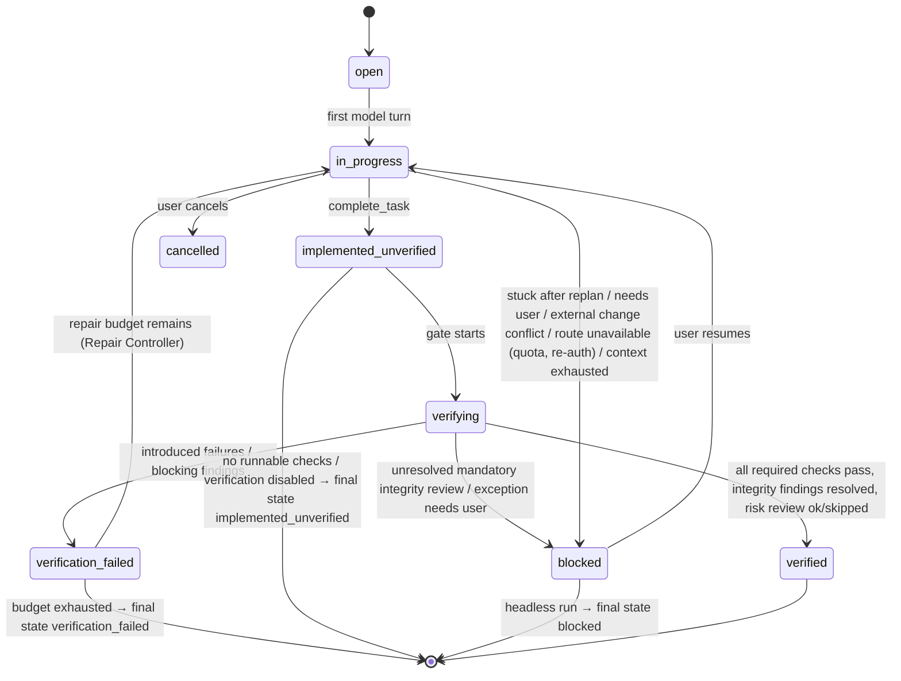

# Spec: Verification Engine

- Package: `packages/core` (`verify/`)
- Decision: [ADR-0009](../adr/0009-verification-architecture.md), amended by [ADR-0016](../adr/0016-robustness-amendments.md)
- Collaborators: [Task Contract](task-contract.md), [Artifact Store](artifact-store.md), [Test Integrity Guard](test-integrity-guard.md), [Critic](critic.md), [Repair/Replan Controller](repair-replan-controller.md), Checkpoint Manager

## Responsibility

- Own the **task state machine**. Only this engine can mark a task `verified`, for every route
  and harness profile. Profiles, learned skills and critic output cannot change which checks are
  required.
- Discover and maintain the project's **verification profile**.
- Run **tiered checks** at the right moments, classify failures as introduced, pre-existing or
  baseline-flaky (with **no** "passed on rerun, so ignore it" shortcut), and produce an
  **evidence bundle** reported against the user-owned [Task Contract](task-contract.md).
- Run the **completion gate** when the model calls `complete_task`.

**Not responsible for:** fixing failures (the model does, steered by the Repair Controller), or
pre-write validation (the Firewall does T0/T1 inline).

## Task state machine



**Final reported states:** `verified`, `verification_failed`, `implemented_unverified`,
`blocked`, `cancelled`. The CLI shows the state prominently, never just "done". `blocked`
always carries a reason (`stuck`, `integrity_review_required`, `recovery_conflict`,
`external_change`, `needs_user`, `route` (quota, re-authentication or usage unavailable;
resuming or switching route is the user's choice), `context_exhausted`). In headless runs it is a final state.

## Verification profile

```ts
interface VerificationProfile {
  version: 1;
  languages: ("typescript" | "javascript" | "python")[];
  checks: CheckSpec[];
  relatedTests?: RelatedTestsStrategy[];      // how to pick targeted tests
  timeouts: { defaultS: number };
  t4Policy: "always" | "risk_medium_plus" | "risk_high" | "never";
  ignorePaths?: string[];                     // generated code etc.
  firewall?: { allowUnresolved?: string[] };
  knownFlaky?: KnownFlakyEntry[];             // user-approved exceptions only (see classification)
}
interface KnownFlakyEntry {
  testId: string;
  reason: string;
  addedBy: "user";                            // model edits to this list are Integrity Guard I13
  addedAt: string;
  expires?: string;                           // default: 90 days
}
interface CheckSpec {
  id: string;                                 // "typecheck", "lint", "unit", "format"
  tier: "T2" | "T3" | "T4";
  command: string[];                          // argv; {files} placeholder allowed for file-scoped checks
  scope: "project" | "changed_files" | "related_tests";
  parser?: string;                            // artifact parser id (tsc, vitest, pytest, ...)
  cwd?: string;
  required: boolean;                          // must pass for 'verified'
}
type RelatedTestsStrategy =
  | { kind: "runner_native"; command: string[] }    // e.g. vitest related {files} --run ; jest --findRelatedTests {files}
  | { kind: "import_graph" }                        // index: tests importing changed modules (depth ≤ 2)
  | { kind: "naming"; patterns: string[] };         // src/a.ts → test/a.test.ts, tests/test_a.py
```

**Discovery** (`kai init`, or first task): inspect `package.json` scripts (`typecheck`, `lint`,
`test`, `test:unit`), `tsconfig*.json`, `vitest`/`jest` configs, `pyproject.toml` (`pytest`,
`mypy`, `ruff`, `pyright` sections), `Makefile`/`justfile` targets, and
`.github/workflows/*.yml` steps. Propose a profile, show it to the user, and persist it to
`.kai/project.json` once confirmed. Headless runs require an existing profile or
`--accept-discovered-profile`.

## Tiers and triggers

| Tier | Trigger | Default scope | Blocking for `verified` |
|---|---|---|---|
| T0 Apply | Every transaction (Firewall) | Edited files | — (rejects pre-write) |
| T1 File diagnostics | Every transaction (Firewall LSP delta) | Edited files + ≤ 10 dependents | Introduced **errors** at gate time block |
| T2 Affected | (a) background after a model turn that changed files, if `verify.backgroundT2` (default on for typecheck); (b) gate | Typecheck project(s) containing changed files; lint and format on changed files | `required` checks |
| T3 Targeted tests | (a) when the model runs tests; (b) gate | Related tests via profile strategies (union), capped at `maxTargetedTests` (default 200 test files) | yes, if any are found; "no related tests found" is reported |
| T4 Broad | Gate, per `t4Policy` and risk | Full suite / regression command | yes, when run |

**Background T2** results reach the model as a `verification` notice before the next request,
but **only if they contain introduced failures** (green results are silent and cost no tokens).

## Completion gate

```
complete_task(summary, claims)
 1. task → implemented_unverified; ensure no pending/late firewall findings
 2. run T2 (required checks)            ─┐
 3. run T3 targeted tests                ├─ in parallel where independent; each result → artifact + parsed
 4. run T4 if policy/risk requires      ─┘
 5. classify failures (lazy baseline, below)
 6. diff hygiene: no leftover debug prints added (console.log/print in non-test code, per heuristics),
    no stray files (scratch files, *.orig, .kai-tmp-*), no conflict markers, no .only/.skip added (guard)
 7. Test Integrity Guard review of the whole task diff, then resolution of every finding
    (contract citation / mandatory integrity_review / user approval). Any unresolved finding
    → interactive: permission.request kind="integrity"; headless: final state blocked
    (integrity_review_required). Never verified.
 8. unfulfilled promissory symbols? → fail
 9. Optional risk_review (critic) if risk triggers fire (after 1–8 pass); skippable when its
    budget is exhausted or it is disabled
10. verdict → TaskVerdict event + evidence bundle (checks mapped to contract entries)
```

Step 7 and step 9 are deliberately different: **mandatory integrity resolution cannot be
skipped**, while the **optional risk review can**
([critic.md](critic.md#modes-and-budgets)).

The result to the model:
- **VERIFIED**: a one-paragraph evidence summary. The task ends, and the model gets no further
  turn except to answer the user.
- **VERIFICATION FAILED**: introduced failures only, shaped (parsed test failures, diagnostics,
  integrity findings, critic blocking findings), each with an artifact reference, plus the repair
  budget remaining. Pre-existing failures are listed in one line ("3 pre-existing failures,
  unchanged; not your responsibility").

## Lazy baseline classification

A failure that disappears on rerun is **not** evidence that it is harmless. A newly introduced
race condition produces exactly that pattern. Only **established baseline flakiness**, or an
**explicit user-approved exception**, may keep an intermittent failure from blocking.

For each failing check at the gate:
1. **Fingerprint** each failure (test ID + assertion class; diagnostic code + symbol + path).
2. **Rerun now:** rerun each failing *test* `verify.rerunsNow` more times (default 4, so 5 runs
   in total), targeted by test ID (or by test file if the runner cannot target single tests).
   This gives the current failure rate `f_now`. Deterministic checks (typecheck, lint) are rerun
   once only, to rule out an environment error.
3. **Baseline runs:** in a temporary worktree at the **task-start checkpoint**
   (`git worktree add --detach <tmp> <checkpoint-commit>`, with a shared `node_modules` or venv
   via symlink when safe, or the profile's `baselineSetup`), run the same failing tests
   `verify.baselineRuns` times (default 5). This gives the baseline failure rate `f_base`.
   Results are cached by (checkpoint commit, test ID).
4. **Flake history:** the projection `flake_history(test_id, commit, passes, failures, ts)` is
   written **only from baseline runs**, i.e. workspace states that contain none of the task's
   changes. Runs that include agent changes never contribute.
5. **Classify** (first matching rule wins):

| Class | Condition | Blocks `verified`? |
|---|---|---|
| `pre_existing` | Fails in every baseline run (`f_base = 1`) | No (reported) |
| `known_flaky` | Test is in the profile's user-approved `knownFlaky` list (unexpired), or the user approved a per-task `verification_exception` (recorded as a contract `approval` entry) | No (reported, with the approval) |
| `baseline_flaky` | Baseline shows both passes and failures (`0 < f_base < 1`), or `flake_history` within `verify.flakeHistoryDays` (default 30) shows both passes and failures at a baseline state, **and** `f_now − f_base < verify.flakyWorseningDelta` (default 0.4) | No (reported) |
| `introduced` | Everything else, including when the baseline passed every run while the failure appears now even once. **`introduced_intermittent`** is the sub-label when `0 < f_now < 1` | **Yes** |

6. A `baseline_flaky` test whose failure rate rose by at least `flakyWorseningDelta` (e.g. 1/5
   at baseline, 3/5 now) is classified `introduced`, because the change made it worse.
7. **Fail closed:** if baseline execution is impossible (setup fails, worktree cannot be
   created), failures are `introduced`, and the report says so.

The model sees intermittent introductions explicitly:
*"INTRODUCED (intermittent): users.test.ts > concurrent updates failed 2/5 runs now; baseline
passed 5/5. Likely a race, ordering or timing defect in your change."*

**Exceptions are user-owned.** `knownFlaky` lives in `.kai/project.json`. Model edits to it, or
to any rerun or retry settings in test configs (e.g. adding `retry: 3`), are verification-config
changes under Integrity Guard **I13**, and block when they would make a failing check pass. In
interactive mode the user can grant a one-off exception through
`permission.request kind="verification_exception"`.

**Statistical honesty.** With 5 baseline runs, a test that flakes 10% of the time at baseline is
observed flaking only about 41% of the time. Otherwise it is classified `introduced` (fail
closed). The remedy is user-owned: approve an exception or add it to `knownFlaky`. Flake history
also accumulates across tasks, so repeat offenders become established. The report always shows
the run counts (`now 1/5 failed, baseline 0/5`) so the evidence can be judged.

## Evidence bundle

```ts
interface EvidenceBundle {
  taskId: TaskId;
  finalState: TaskState;
  checks: { id: string; tier: string; status: "pass" | "fail" | "skipped" | "error";
            classification?: "introduced" | "introduced_intermittent" | "pre_existing" | "baseline_flaky" | "known_flaky";
            runs?: { now: { passed: number; failed: number }; baseline?: { passed: number; failed: number } };
            artifactId?: ArtifactId; summary: string }[];
  contract: { version: number; hash: ContentHash };          // what the task was graded against
  criteriaCoverage?: { entryId: string; checks: string[] }[]; // which checks evidence which contract entries (best effort)
  diffStat: { files: number; insertions: number; deletions: number };
  integrity: IntegrityFinding[];        // each with resolution: contract_backed | critic_consistent | user_approved | unresolved
  critic?: { riskReview: { ran: boolean; skippedReason?: string; triggers: string[]; findings: CriticFinding[] };
             integrityReview?: { ran: boolean; verdicts: IntegrityVerdict[] } };
  blockedReason?: "stuck" | "integrity_review_required" | "recovery_conflict" | "external_change" | "needs_user";
  unverifiedReasons?: string[];        // e.g. "no test command configured"
}
```

## Telemetry

Per task: `gate_runs`, `gate_pass_first_try`, `introduced_failures`,
`introduced_intermittent`, `preexisting_failures`, `baseline_flaky`, `known_flaky_used`,
reruns and baseline runs executed (with time), time per tier, `premature_completion` (a
`complete_task` that failed the gate), `blocked_integrity_review`, `final_state`.

## Acceptance tests

1. A TS fixture with a pre-existing failing test: the agent's unrelated change passes the gate
   as `verified`, with the pre-existing failure listed.
2. An introduced type error caught at T2 → `verification_failed` with the exact diagnostic.
3. No profile, headless → `implemented_unverified` with reasons.
4. **Introduced race:** a change that makes a concurrency test fail 1 in 5 runs, while the
   baseline passes 5/5 → `introduced_intermittent`, which blocks `verified`, with run counts in
   the evidence.
5. **Baseline flaky:** a test that fails 2/5 at the baseline and 2/5 now → `baseline_flaky`.
   It does not block, and it is reported.
6. **Worsened flake:** baseline 1/5, now 4/5 → `introduced`.
7. **User exception:** a test in `knownFlaky` (added by the user) → `known_flaky`, which does
   not block. The model adding the same entry → I13 block.
8. **Baseline impossible:** the worktree setup fails → every failure is `introduced`, with the
   reason reported.
9. `.only` added → the gate fails through the integrity guard.
10. A contract-backed I6 finding with the integrity review unavailable → headless final state
   `blocked` (`integrity_review_required`), not `verified`.
11. State machine property: there is no path to `verified` without a `VerificationRunCompleted`
   for every required check.
12. **Profile and route independence:** the same fixture task through the fake `gemini`, `openai`
    and `generic` profiles runs the identical set of required checks at the gate, and only
    this engine emits `verified` in each case.
