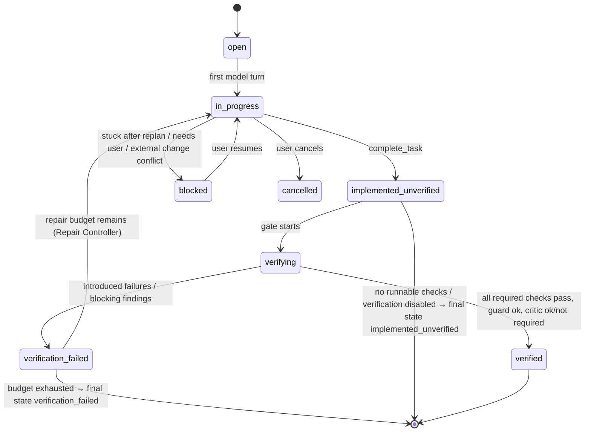

# Spec: Verification Engine

- Package: `packages/core` (`verify/`)
- Decision: [ADR-0009](../adr/0009-verification-architecture.md)
- Collaborators: [Artifact Store](artifact-store.md), [Test Integrity Guard](test-integrity-guard.md), [Critic](critic.md), [Repair/Replan Controller](repair-replan-controller.md), Checkpoint Manager

## Responsibility

- Own the **task state machine**. Only this engine can mark a task `verified`.
- Discover and maintain the project's **verification profile**.
- Run **tiered checks** at the right moments, classify failures as introduced, pre-existing or
  flaky, and produce an **evidence bundle**.
- Run the **completion gate** when the model calls `complete_task`.

**Not responsible for:** fixing failures (the model does, steered by the Repair Controller), or
pre-write validation (the Firewall does T0/T1 inline).

## Task state machine



**Final reported states:** `verified`, `verification_failed`, `implemented_unverified`,
`blocked`, `cancelled`. The CLI shows the state prominently, never just "done".

## Verification profile

```ts
interface VerificationProfile {
  version: 1;
  languages: ("typescript" | "javascript" | "python")[];
  checks: CheckSpec[];
  relatedTests?: RelatedTestsStrategy[];      // how to pick targeted tests
  timeouts: { defaultS: number };
  t4Policy: "always" | "risk_medium_plus" | "risk_high" | "never";
  ignorePaths?: string[];                     // generated code etc.
  firewall?: { allowUnresolved?: string[] };
}
interface CheckSpec {
  id: string;                                 // "typecheck", "lint", "unit", "format"
  tier: "T2" | "T3" | "T4";
  command: string[];                          // argv; {files} placeholder allowed for file-scoped checks
  scope: "project" | "changed_files" | "related_tests";
  parser?: string;                            // artifact parser id (tsc, vitest, pytest, ...)
  cwd?: string;
  required: boolean;                          // must pass for 'verified'
}
type RelatedTestsStrategy =
  | { kind: "runner_native"; command: string[] }    // e.g. vitest related {files} --run ; jest --findRelatedTests {files}
  | { kind: "import_graph" }                        // index: tests importing changed modules (depth ≤ 2)
  | { kind: "naming"; patterns: string[] };         // src/a.ts → test/a.test.ts, tests/test_a.py
```

**Discovery** (`kai init`, or first task): inspect `package.json` scripts (`typecheck`, `lint`,
`test`, `test:unit`), `tsconfig*.json`, `vitest`/`jest` configs, `pyproject.toml` (`pytest`,
`mypy`, `ruff`, `pyright` sections), `Makefile`/`justfile` targets, and
`.github/workflows/*.yml` steps. Propose a profile, show it to the user, and persist it to
`.kai/project.json` once confirmed. Headless runs require an existing profile or
`--accept-discovered-profile`.

## Tiers and triggers

| Tier | Trigger | Default scope | Blocking for `verified` |
|---|---|---|---|
| T0 Apply | Every transaction (Firewall) | Edited files | — (rejects pre-write) |
| T1 File diagnostics | Every transaction (Firewall LSP delta) | Edited files + ≤ 10 dependents | Introduced **errors** at gate time block |
| T2 Affected | (a) background after a model turn that changed files, if `verify.backgroundT2` (default on for typecheck); (b) gate | Typecheck project(s) containing changed files; lint and format on changed files | `required` checks |
| T3 Targeted tests | (a) when the model runs tests; (b) gate | Related tests via profile strategies (union), capped at `maxTargetedTests` (default 200 test files) | yes, if any are found; "no related tests found" is reported |
| T4 Broad | Gate, per `t4Policy` and risk | Full suite / regression command | yes, when run |

**Background T2** results reach the model as a `verification` notice before the next request,
but **only if they contain introduced failures** (green results are silent and cost no tokens).

## Completion gate

```
complete_task(summary, claims)
 1. task → implemented_unverified; ensure no pending/late firewall findings
 2. run T2 (required checks)            ─┐
 3. run T3 targeted tests                ├─ in parallel where independent; each result → artifact + parsed
 4. run T4 if policy/risk requires      ─┘
 5. classify failures (lazy baseline, below)
 6. diff hygiene: no leftover debug prints added (console.log/print in non-test code, per heuristics),
    no stray files (scratch files, *.orig, .kai-tmp-*), no conflict markers, no .only/.skip added (guard)
 7. Test Integrity Guard review of the whole task diff
 8. unfulfilled promissory symbols? → fail
 9. Critic if triggers fire (after 1–8 pass)
10. verdict → TaskVerdict event + evidence bundle
```

The result to the model:
- **VERIFIED**: a one-paragraph evidence summary. The task ends, and the model gets no further
  turn except to answer the user.
- **VERIFICATION FAILED**: introduced failures only, shaped (parsed test failures, diagnostics,
  integrity findings, critic blocking findings), each with an artifact reference, plus the repair
  budget remaining. Pre-existing failures are listed in one line ("3 pre-existing failures,
  unchanged; not your responsibility").

## Lazy baseline classification

For each failing check at the gate:
1. Fingerprint each failure (test ID + assertion class; diagnostic code + symbol + path).
2. Lookup cache: `baseline_results(task_start_checkpoint, check_id)`.
3. On a cache miss: create a temporary worktree at the **task-start checkpoint**
   (`git worktree add --detach <tmp> <checkpoint-commit>`), with a shared `node_modules` or venv
   via symlink when safe or the profile's `baselineSetup` command, run the same check, and parse
   and cache the result.
4. Classify: **introduced** (fails now, passed at baseline), **pre-existing** (fails in both),
   **flaky** (rerun up to 2× now; passes on a rerun).
5. Only *introduced* failures block. Flaky ones are reported, and the profile can mark tests as
   known-flaky.

If baseline execution is impossible (setup fails), failures are treated as *introduced*,
conservatively, and the report says so.

## Evidence bundle

```ts
interface EvidenceBundle {
  taskId: TaskId;
  finalState: TaskState;
  checks: { id: string; tier: string; status: "pass" | "fail" | "skipped" | "error";
            classification?: "introduced" | "pre_existing" | "flaky"; artifactId?: ArtifactId;
            summary: string }[];
  diffStat: { files: number; insertions: number; deletions: number };
  integrity: IntegrityFinding[];
  critic?: { ran: boolean; triggers: string[]; findings: CriticFinding[] };
  unverifiedReasons?: string[];        // e.g. "no test command configured"
}
```

## Telemetry

Per task: `gate_runs`, `gate_pass_first_try`, `introduced_failures`, `preexisting_failures`,
`flaky_detected`, time per tier, `premature_completion` (a `complete_task` that failed the
gate), `final_state`.

## Acceptance tests

1. A TS fixture with a pre-existing failing test: the agent's unrelated change passes the gate
   as `verified`, with the pre-existing failure listed.
2. An introduced type error caught at T2 → `verification_failed` with the exact diagnostic.
3. No profile, headless → `implemented_unverified` with reasons.
4. Flaky test (fails 50% of the time) → classified as flaky after reruns. It does not block, and
   it is reported.
5. `.only` added → the gate fails through the integrity guard.
6. State machine property: there is no path to `verified` without a `VerificationRunCompleted`
   for every required check.
